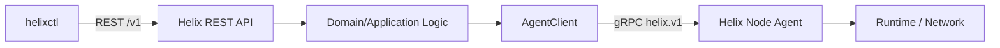

# Helixctl API

> External REST contract for `helixctl -> helixd` and internal gRPC contract for `helixd -> helix-agent`.

---

## 1. API Boundaries

Helixctl intentionally uses two API styles.

```text
User / helixctl
      |
     REST
      |
      v
Helix Control Plane
      |
     gRPC
      |
      v
Helix Node Agent
```

REST is the user-facing cluster API.

gRPC is the internal node-control protocol.

The two APIs should not share transport-specific structs directly.

---

# 2. Why REST Externally

REST is used for the external Control Plane API because it is:

- easy to inspect with `curl`
- easy to document with OpenAPI
- easy to test with Postman
- easy for future UI clients to consume
- independent of Go

---

# 3. Why gRPC Internally

gRPC is used between Control Plane and Agent because:

- operations map naturally to RPC calls
- Protobuf creates explicit contracts
- Go support is strong
- internal messages remain typed
- streaming can be added later

See [`adr/001-internal-grpc.md`](adr/001-internal-grpc.md).

---

# 4. API Versioning

External REST path:

```text
/v1/...
```

Internal Protobuf package:

```text
helix.v1
```

Breaking changes should introduce a new version rather than silently changing existing semantics.

---

# 5. REST Resources

Initial resources:

```text
containers
nodes
services
```

Potential future resources:

```text
events
routes
images
volumes
```

Only the first three are required initially.

---

# 6. Create Container

```http
POST /v1/containers
Content-Type: application/json
```

Example request:

```json
{
  "name": "auth",
  "rootfs": "/opt/helix/rootfs/busybox",
  "command": ["/bin/sh", "-c", "sleep 3600"],
  "resources": {
    "cpu_millis": 500,
    "memory_bytes": 134217728
  },
  "service": {
    "name": "auth",
    "port": 8080
  }
}
```

Possible response:

```json
{
  "id": "ctr-01JXYZ",
  "name": "auth",
  "desired_state": "RUNNING",
  "actual_state": "PENDING"
}
```

---

# 7. List Containers

```http
GET /v1/containers
```

Example:

```json
{
  "items": [
    {
      "id": "ctr-01JXYZ",
      "name": "auth",
      "node_id": "node-b",
      "desired_state": "RUNNING",
      "actual_state": "RUNNING",
      "ip": "10.10.2.7"
    }
  ]
}
```

---

# 8. Inspect Container

```http
GET /v1/containers/{container_id}
```

Useful fields:

```text
ID
Name
Command
Node
Desired State
Actual State
IP
Service
Created At
Last Update
Exit information
```

---

# 9. Stop Container

A simple first API can use:

```http
DELETE /v1/containers/{container_id}
```

Semantics:

```text
Desired State -> STOPPED
```

The Reconciler/Control Plane requests termination through the assigned Agent.

A future API can distinguish stop from permanent delete if container lifecycle becomes more advanced.

---

# 10. List Nodes

```http
GET /v1/nodes
```

Example:

```json
{
  "items": [
    {
      "id": "node-b",
      "hostname": "worker-b",
      "management_ip": "192.168.50.12",
      "container_cidr": "10.10.2.0/24",
      "health": "HEALTHY",
      "network_ready": true,
      "cpu_available_millis": 2500,
      "memory_available_bytes": 2147483648
    }
  ]
}
```

---

# 11. Inspect Node

```http
GET /v1/nodes/{node_id}
```

Can expose:

- capacity
- availability
- health
- last heartbeat
- network readiness
- container CIDR
- assigned workloads

---

# 12. Create Service

Services may be created explicitly or implicitly from workload requests depending on final implementation.

Explicit form:

```http
POST /v1/services
```

```json
{
  "name": "auth",
  "port": 8080
}
```

---

# 13. List Services

```http
GET /v1/services
```

Example:

```json
{
  "items": [
    {
      "name": "auth",
      "dns_name": "auth.service.cluster",
      "port": 8080,
      "healthy_endpoints": 2
    }
  ]
}
```

---

# 14. Inspect Service

```http
GET /v1/services/{service_name}
```

Example:

```json
{
  "name": "auth",
  "dns_name": "auth.service.cluster",
  "port": 8080,
  "endpoints": [
    {
      "container_id": "ctr-a",
      "node_id": "node-a",
      "ip": "10.10.1.4",
      "health": "HEALTHY"
    },
    {
      "container_id": "ctr-b",
      "node_id": "node-b",
      "ip": "10.10.2.7",
      "health": "HEALTHY"
    }
  ]
}
```

---

# 15. REST Error Format

Use one consistent error envelope.

Example:

```json
{
  "error": {
    "code": "NO_ELIGIBLE_NODE",
    "message": "no healthy node has enough resources",
    "request_id": "req-123"
  }
}
```

---

# 16. Suggested REST Error Codes

```text
INVALID_ARGUMENT
NOT_FOUND
CONFLICT
NO_ELIGIBLE_NODE
NODE_UNAVAILABLE
RUNTIME_ERROR
NETWORK_ERROR
SERVICE_ERROR
INTERNAL
```

HTTP mapping can be:

```text
400 INVALID_ARGUMENT
404 NOT_FOUND
409 CONFLICT
503 NO_ELIGIBLE_NODE / NODE_UNAVAILABLE
500 internal execution failures where appropriate
```

Do not expose raw internal filesystem paths or sensitive stack traces to external clients.

---

# 17. Request IDs

Every external request should receive or generate a request ID.

The ID should be propagated through:

```text
REST handler
Control Plane operation
AgentClient
gRPC metadata/logging
Node Agent logs
```

This makes multi-component debugging much easier.

---

# 18. Internal gRPC Service

Conceptual Protobuf service:

```proto
service AgentService {
  rpc RegisterNode(RegisterNodeRequest) returns (RegisterNodeResponse);
  rpc Heartbeat(HeartbeatRequest) returns (HeartbeatResponse);

  rpc RunContainer(RunContainerRequest) returns (RunContainerResponse);
  rpc StopContainer(StopContainerRequest) returns (StopContainerResponse);
  rpc RemoveContainer(RemoveContainerRequest) returns (RemoveContainerResponse);
  rpc InspectContainer(InspectContainerRequest) returns (InspectContainerResponse);
  rpc ListContainers(ListContainersRequest) returns (ListContainersResponse);

  rpc ApplyRoutes(ApplyRoutesRequest) returns (ApplyRoutesResponse);
}
```

The actual `.proto` file remains the source of truth once implementation begins.

---

# 19. RegisterNode

Agent -> Control Plane logically contains:

```text
Node ID
Hostname
Management IP
Container CIDR
CPU Capacity
Memory Capacity
Agent Version
Network Readiness
```

The response can return:

```text
accepted
cluster settings
heartbeat interval
configuration generation
```

Depending on how much configuration is centralized.

---

# 20. Heartbeat

Heartbeat request:

```text
Node ID
Timestamp
CPU Available
Memory Available
Network Ready
Container Summary
```

The first version can use unary heartbeats.

Future version:

```text
bidirectional status stream
```

without changing the external REST API.

---

# 21. RunContainer

Control Plane -> Agent.

Request concept:

```text
Container ID
Name
RootFS
Command
Args
Environment
CPU
Memory
Hostname
Network/Service metadata needed locally
```

The Agent converts this into Runtime and Network Manager operations.

---

# 22. RunContainer Response

Useful response:

```text
Accepted / Failed
Container ID
Actual State
Host PID
Container IP
Error Code
Error Message
```

The Control Plane converts the response into domain state.

---

# 23. StopContainer

Request:

```text
Container ID
Grace Period
```

Agent behavior:

```text
SIGTERM
wait
SIGKILL if required
```

Response includes final state.

---

# 24. InspectContainer

Returns local actual state.

Useful during:

- Control Plane reconstruction after restart
- debugging
- reconciliation
- manual inspection

---

# 25. ListContainers

Returns containers currently known/running on a worker.

This is especially important after `helixd` restarts because the first version has no durable Control Plane state.

---

# 26. ApplyRoutes

Request:

```text
Generation
Desired Routes[]
```

Example route:

```text
destination_cidr = 10.10.3.0/24
next_hop         = 192.168.50.13
```

The Agent passes desired routes to its local Route Manager.

The Route Manager reconciles actual kernel routes.

---

# 27. Route Generation

A generation/revision field is useful to prevent older route updates from overwriting newer topology.

Example:

```text
generation 41
generation 42
```

If 41 arrives after 42, the Agent can reject it as stale.

This is a useful distributed-systems safeguard even in the first non-HA Control Plane.

---

# 28. Domain vs Transport Types

Do not use generated Protobuf messages as the Control Plane's core domain objects.

Correct:

```text
domain.ContainerSpec
    ↓
AgentClient
    ↓
helix.v1.RunContainerRequest
```

Similarly:

```text
REST CreateContainerRequest
    ↓
domain.ContainerSpec
```

This keeps HTTP and gRPC replaceable at the edges.

---

# 29. gRPC Error Mapping

Internal errors should be mapped consistently.

Examples:

```text
InvalidArgument
NotFound
AlreadyExists
FailedPrecondition
Unavailable
Internal
```

The Agent should preserve useful low-level error context in logs while returning a stable API error to the Control Plane.

---

# 30. Timeouts

Every cross-process call should have a deadline.

Examples:

```text
RunContainer
StopContainer
InspectContainer
ApplyRoutes
```

No Control Plane goroutine should wait forever for an Agent RPC.

Timeout values should be configuration, not hardcoded throughout the codebase.

---

# 31. Retry Policy

Not every RPC should be blindly retried.

Safe retry behavior depends on idempotency.

Examples:

```text
InspectContainer
ListContainers
ApplyRoutes with full desired state
```

are easier to retry.

`RunContainer` needs container identity/idempotency rules so a retry does not accidentally create duplicate local workloads.

---

# 32. Idempotent Container IDs

The Control Plane creates a unique Container ID before contacting the Agent.

The Agent should treat:

```text
RunContainer(container_id=ctr-123)
```

for an already-existing `ctr-123` as an idempotent/recoverable case rather than automatically creating a second process.

---

# 33. Authentication

The first lab version may run on a trusted private network.

Production-grade authentication is out of scope initially.

Future work should include:

```text
mTLS between helixd and agents
external API authentication
authorization
certificate rotation
```

See [`SECURITY.md`](SECURITY.md).

---

# 34. OpenAPI

The REST contract should be maintained in:

```text
api/openapi/helix.yaml
```

That file should define:

- paths
- schemas
- error responses
- examples
- status codes

The CLI can use handwritten or generated client code depending on implementation preference.

---

# 35. Protobuf

The internal source contract lives under:

```text
api/proto/helix/v1/
```

Generated Go output lives under:

```text
gen/proto/helix/v1/
```

Generated code should not be hand-edited.

---

# 36. API Testing

REST tests:

```text
request validation
error mapping
container creation
node listing
service inspection
```

gRPC tests:

```text
Agent registration
heartbeat
RunContainer
StopContainer
route application
timeouts
stale route generation
```

---

# 37. API Definition of Done

- [ ] `/v1` REST API is documented.
- [ ] OpenAPI contract exists.
- [ ] Container create/list/inspect/stop work.
- [ ] Node list/inspect work.
- [ ] Service list/inspect work.
- [ ] Error envelope is consistent.
- [ ] Request IDs are logged.
- [ ] Agent Protobuf contract exists.
- [ ] Registration works.
- [ ] Heartbeat works.
- [ ] Container lifecycle RPCs work.
- [ ] Route update RPC works.
- [ ] RPC deadlines are used.
- [ ] Domain objects are not Protobuf objects.
- [ ] Retry/idempotency rules are documented.

---

# 38. API Flow Diagram


