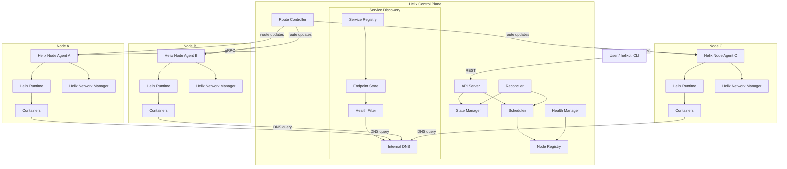
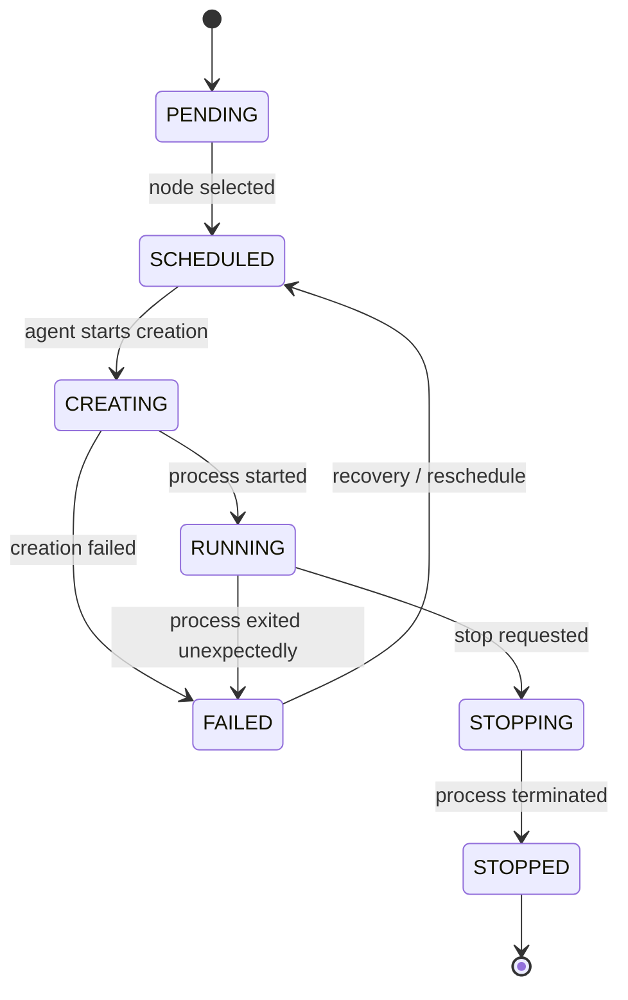
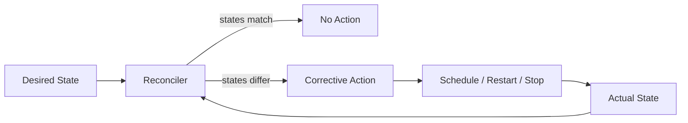
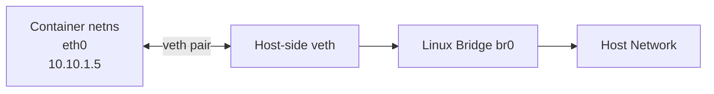
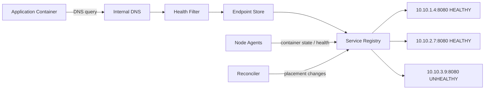
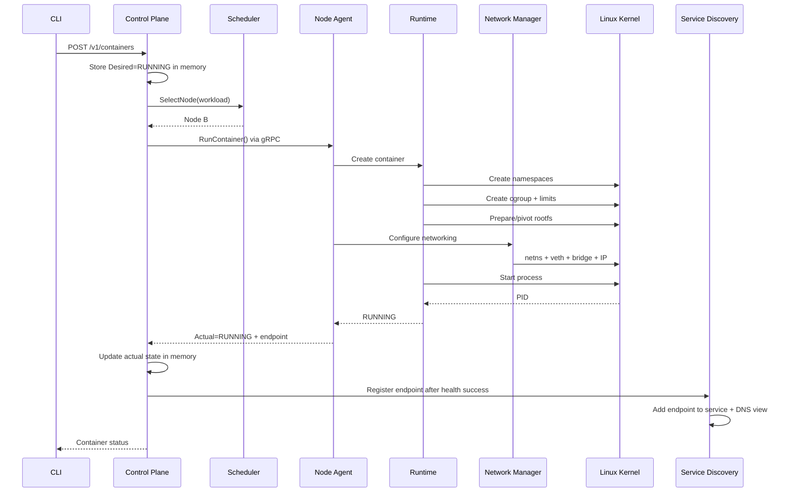
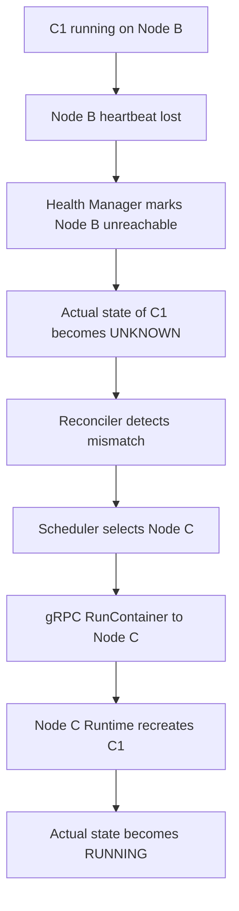
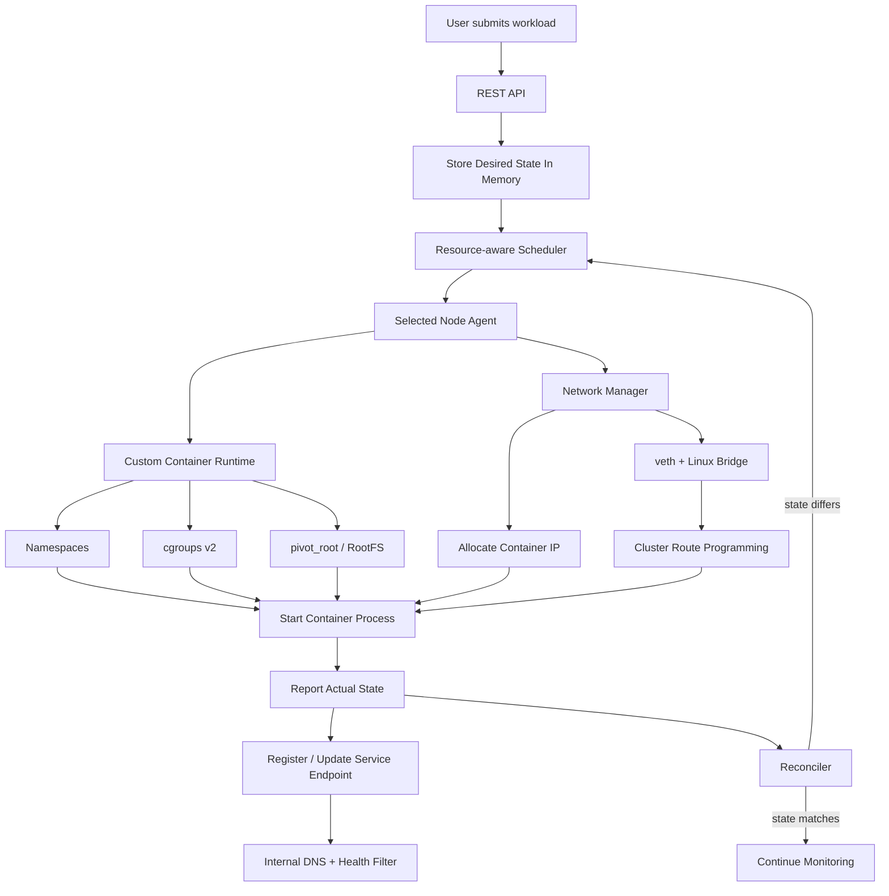

# Helixctl Architecture — Container Runtime + Orchestrator + Networking

**Project Name:** Helixctl  
**Primary CLI Command:** `helixctl`

## 1. Overview

This project implements a small container platform in Go by combining three tightly coupled subsystems:

- a custom Linux container runtime,
- a multi-node container orchestrator,
- and container networking across Linux hosts.

The platform accepts a workload request through a CLI/API, selects a suitable node, creates an isolated Linux process on that node, configures its resources and networking, monitors its state, and recreates the workload on another node when the assigned node becomes unavailable.

The purpose of the design is to keep the important infrastructure mechanisms visible instead of hiding them behind Docker or Kubernetes.

---

## 2. System Goals

The system should support the following end-to-end flow:

```text
Submit workload
    ↓
Store desired state in memory
    ↓
Select a healthy node
    ↓
Send execution request to that node
    ↓
Create namespaces and cgroups
    ↓
Prepare isolated root filesystem
    ↓
Create container network
    ↓
Start process
    ↓
Report actual state
    ↓
Continuously monitor node and workload
    ↓
Reconcile failures or state drift
```

### Core capabilities

- Linux process isolation using namespaces
- CPU and memory isolation using cgroups v2
- isolated root filesystem using `pivot_root`
- container lifecycle management
- multi-node scheduling
- resource-aware placement
- node registration
- heartbeats and failure detection
- desired-state reconciliation
- veth-based container networking
- Linux bridge networking
- per-node container CIDRs
- automatic host-route programming
- health-aware service discovery with stable internal DNS names
- workload recreation after node failure
- in-memory control-plane state

---

## 3. Canonical Component Names

The project uses the following names consistently:

```text
Helixctl
├── helixctl CLI
├── Helix Control Plane
├── Helix Node Agent
├── Helix Runtime
├── Helix Network Manager
└── Helix Service Discovery
```

The executable users interact with is:

```bash
helixctl
```

---

# 4. Main Architecture

Helixctl is divided into the **Helix Control Plane** and worker nodes.



---

# 5. Architectural Boundaries

## 5.1 Helix Control Plane

The **Helix Control Plane** is responsible for cluster-wide decisions.

It does **not** directly execute Linux syscalls on worker nodes.

Its responsibilities are:

- expose the external API,
- store desired state in memory,
- track registered nodes,
- track available CPU and memory,
- schedule workloads,
- monitor node health,
- compare desired state with actual state,
- trigger recovery actions,
- maintain service records,
- manage node CIDRs and route distribution.

The Control Plane answers:

> What should be running, and where should it run?

---

## 5.2 Helix Node Agent

Each worker node runs one long-lived Go process called the **Helix Node Agent**.

The agent is the boundary between cluster-level orchestration and local Linux execution.

Responsibilities:

- register the node,
- send heartbeats,
- report capacity and usage,
- receive container lifecycle commands,
- call the local runtime,
- call the local network manager,
- report container status,
- report process exits,
- apply routing updates from the Control Plane.

The Node Agent answers:

> What does this node need to execute locally?

---

## 5.3 Helix Runtime

The **Helix Runtime** is responsible for process isolation and lifecycle.

It contains:

```text
Container Runtime
├── Namespace Manager
├── Cgroup Manager
├── RootFS Manager
├── Process Manager
└── Runtime State
```

The runtime performs operations such as:

- creating namespaces,
- creating cgroups,
- applying resource limits,
- preparing the root filesystem,
- entering the container mount namespace,
- executing `pivot_root`,
- starting the child process,
- tracking its PID,
- stopping and cleaning up the process.

---

## 5.4 Helix Network Manager

The **Helix Network Manager** is responsible for local container networking.

It handles:

- network namespaces,
- veth pairs,
- Linux bridges,
- container IP allocation,
- interface configuration,
- host forwarding,
- host route programming,
- network cleanup.

---

# 6. Container Model

A container is modeled as an isolated Linux process rather than a virtual machine.

```text
Container
=
Linux Process
+ PID Namespace
+ UTS Namespace
+ Mount Namespace
+ Network Namespace
+ cgroups v2
+ Root Filesystem
+ Virtual Network Interface
```

A conceptual container record:

```go
type Container struct {
    ID          string
    Name        string
    Image       string
    Command     []string

    CPU         int64
    MemoryBytes int64

    NodeID      string
    PID         int
    IPAddress   string

    DesiredState string
    ActualState  string

    CreatedAt time.Time
    UpdatedAt time.Time
}
```

The implementation can evolve, but the separation between identity, placement, process state, resource configuration, and network state should remain.

---

# 7. Container Lifecycle

The container lifecycle is modeled explicitly.



### State meaning

| State | Meaning |
|---|---|
| `PENDING` | Workload exists but has not yet been assigned |
| `SCHEDULED` | A node has been selected |
| `CREATING` | Runtime is building container isolation/networking |
| `RUNNING` | Container process is alive |
| `FAILED` | Creation or runtime execution failed |
| `STOPPING` | Termination is in progress |
| `STOPPED` | Container was intentionally stopped |

---

# 8. Desired State and Actual State

The system stores desired state separately from actual state.

Example:

```text
Desired State = RUNNING
Actual State  = RUNNING
```

No action is required.

If:

```text
Desired State = RUNNING
Actual State  = FAILED
```

the system attempts recovery.

If:

```text
Desired State = STOPPED
Actual State  = RUNNING
```

the system requests termination.

This separation is important because the orchestrator should not depend on one-time commands. It should continuously try to make the current system state converge toward the requested state.

---

# 9. Reconciliation Loop

A reconciliation loop runs inside the Control Plane.



Conceptually:

```text
for each workload:
    read desired state
    read actual state

    if desired != actual:
        calculate corrective action
        execute corrective action
```

### Why reconciliation is used

A command-only design would work only when everything succeeds the first time.

Reconciliation allows the system to recover from:

- process crashes,
- node failure,
- Control Plane restart,
- temporary execution errors,
- state drift,
- delayed agent reports.

---

# 10. External API

## Decision

The external client interface uses **REST over HTTP**.

Example endpoints:

```http
POST   /v1/containers
GET    /v1/containers
GET    /v1/containers/{id}
DELETE /v1/containers/{id}

GET    /v1/nodes
GET    /v1/nodes/{id}

POST   /v1/services
GET    /v1/services
```

### Why REST

REST is appropriate at the external boundary because it is:

- easy to inspect with `curl`,
- easy to test through Postman,
- straightforward to document with OpenAPI,
- language-independent,
- suitable for future web/UI clients.

The CLI is therefore only a client of the Control Plane.

```text
helixctl
     |
    REST
     |
Control Plane
```

The CLI never directly invokes the runtime.

---

# 11. Internal Node Communication

## Decision

Control Plane ↔ Node Agent communication uses **gRPC**.

Example RPCs:

```text
RegisterNode
Heartbeat
RunContainer
StopContainer
RemoveContainer
InspectContainer
ListContainers
GetNodeStatus
ApplyRoutes
```

### Why gRPC

The internal API is service-to-service communication between Go components.

gRPC was selected because:

- Protobuf provides explicit contracts,
- request/response types are strongly defined,
- Go support is mature,
- RPC semantics match node operations,
- binary serialization is efficient,
- streaming can be added later without redesigning the protocol.

A later version can use streaming for heartbeats, node events, or status updates.

The first implementation can remain mostly unary RPC-based.

---

# 12. In-Memory Control-Plane State

## Decision

The first complete version of Helixctl uses an **in-memory state store** inside `helixd`.

No SQL database or external database service is used.

The Control Plane keeps the current cluster model in memory, including:

- registered nodes,
- node health,
- workloads,
- desired states,
- actual states,
- node assignments,
- services,
- service endpoints,
- node CIDRs,
- container IP allocations,
- route ownership.

Conceptually:

```text
helixd
   |
   v
In-Memory Cluster State
   |
   +-- Nodes
   +-- Workloads
   +-- Services
   +-- Endpoints
   +-- Routes
   +-- IP Allocations
```

A simple internal state object can expose domain-oriented operations instead of raw maps throughout the codebase.

Example:

```go
type ClusterState interface {
    AddNode(node Node) error
    GetNode(id string) (Node, bool)
    ListNodes() []Node

    AddWorkload(workload Workload) error
    UpdateWorkload(workload Workload) error
    GetWorkload(id string) (Workload, bool)
    ListWorkloads() []Workload

    AddService(service Service) error
    UpdateEndpoint(endpoint Endpoint) error
}
```

The implementation can use:

- maps,
- indexes,
- `sync.RWMutex`,
- or other concurrency-safe in-memory structures.

---

## 12.1 Why In-Memory State

The goal of the first complete Helixctl version is to focus on:

- Linux container internals,
- process isolation,
- resource control,
- scheduling,
- node coordination,
- networking,
- service discovery,
- reconciliation.

Adding a database would introduce storage behavior that is not required to prove the core orchestration path.

In-memory state keeps the control-plane implementation transparent and makes state transitions easy to inspect during development.

---

## 12.2 Concurrency Requirements

The Control Plane has multiple goroutines that may read or update cluster state:

```text
REST API handlers
Scheduler
Heartbeat processing
Health Manager
Reconciler
Route Controller
Service Discovery
```

The state layer therefore must be concurrency-safe.

A simple first implementation can use:

```go
type State struct {
    mu sync.RWMutex

    nodes     map[string]Node
    workloads map[string]Workload
    services  map[string]Service
    endpoints map[string][]Endpoint
    routes    map[string]Route
}
```

Reads can use:

```text
RLock
```

Writes can use:

```text
Lock
```

The state package should remain the only place that owns these internal maps directly.

---

## 12.3 Restart Behavior

Because the first version is intentionally in-memory:

```text
helixd restart
    ↓
Control-Plane memory is lost
```

Existing containers on worker nodes may still be running because they are independent Linux processes managed locally by the agents.

After `helixd` restarts:

1. Node Agents reconnect/register again.
2. Agents report their currently running containers.
3. Node capacity and health state are rebuilt.
4. Container actual state is reconstructed from Agent reports.
5. Route ownership is rebuilt from node CIDRs.
6. Service endpoints can be rebuilt from reported running workloads where enough metadata is available.

However, the Control Plane cannot perfectly restore user intent that existed only in memory.

For example:

```text
Desired replica count
Pending workload requests
Previous stop/start intent
```

may be lost after a full Control-Plane restart.

This is an accepted limitation of the first version.

---

## 12.4 Why This Limitation Is Acceptable Initially

The first version is designed to validate the complete runtime and orchestration architecture before adding durable state.

The important behavior remains testable:

```text
submit workload
    ↓
schedule
    ↓
run container
    ↓
network it
    ↓
monitor it
    ↓
discover it
    ↓
reschedule it
```

Durable Control-Plane state can be introduced later as a separate systems feature without changing the core domain interfaces.

---

# 13. Control Plane Availability

## Decision

The first complete version uses **one Control Plane instance**.

### Reason

Multi-Control-Plane availability would immediately require:

- leader election,
- replicated state,
- consensus,
- split-brain prevention,
- distributed locking.

Those are important topics, but they would significantly increase the scope before the runtime, scheduler, networking, and reconciliation path is complete.

A future HA version can introduce:

```text
Control Plane A
Control Plane B
Control Plane C
       |
      Raft
       |
     etcd
```

---

# 14. Node Registration

When a Node Agent starts, it registers with the Control Plane.

Example node information:

```text
Node ID
Hostname
Management IP
Total CPU
Available CPU
Total Memory
Available Memory
Agent Version
Container CIDR
Node Status
```

The Control Plane stores this information in the Node Registry.

---

# 15. Heartbeats and Node Health

The Node Agent periodically reports:

```text
Node ID
Timestamp
CPU availability
Memory availability
Running container count
Container status summary
```

A configurable health policy can look like:

```text
Heartbeat interval: 5 seconds

No heartbeat for 10 seconds
→ SUSPECT

No heartbeat for 15 seconds
→ UNREACHABLE
```

These values are configuration values, not fixed architectural constants.

### Important distributed-systems property

A missing heartbeat does not prove that the machine has crashed.

It only proves:

> The Control Plane cannot currently communicate with the node.

The reason may be:

- process failure,
- host failure,
- network partition,
- overloaded node,
- Control Plane connectivity failure.

The recovery logic must be designed with this ambiguity in mind.

---

# 16. Scheduler Architecture

Scheduling is split into two operations:

```text
Nodes
  |
  v
FILTER
  |
  v
Eligible Nodes
  |
  v
SCORE
  |
  v
Selected Node
```

---

## 16.1 Filtering

A node is rejected when:

- node status is not healthy,
- available CPU is below the request,
- available memory is below the request.

Example:

```text
Workload:
CPU    = 500m
Memory = 128 MB

Node A:
CPU free    = 700m
Memory free = 256 MB
Eligible

Node B:
CPU free    = 3000m
Memory free = 2 GB
Eligible

Node C:
CPU free    = 200m
Memory free = 1 GB
Rejected
```

---

## 16.2 Scoring

## Decision

The primary strategy is **least-load scheduling after resource filtering**.

A scheduler abstraction keeps placement policy replaceable:

```go
type Scheduler interface {
    SelectNode(workload Workload, nodes []Node) (Node, error)
}
```

Possible implementations:

```text
RoundRobinScheduler
LeastLoadScheduler
```

### Why least-load

Pure round-robin distributes requests evenly but ignores actual node utilization.

Example:

```text
Node A = almost full
Node B = mostly idle
```

Round-robin may still select Node A.

Least-load gives the scheduler real infrastructure awareness while remaining understandable and testable.

Round-robin is still useful as:

- an initial baseline,
- a scheduler test implementation,
- a fallback strategy.

---

# 17. Container Runtime Internals

The runtime is decomposed into focused managers.

```text
Container Runtime
│
├── Namespace Manager
├── Cgroup Manager
├── RootFS Manager
├── Process Manager
└── Runtime State
```

Container creation sequence:

```text
Prepare rootfs
    ↓
Create namespaces
    ↓
Create cgroup
    ↓
Apply CPU/memory limits
    ↓
Configure container network
    ↓
pivot_root
    ↓
Spawn process
    ↓
Track PID
    ↓
Report RUNNING
```

---

# 18. Linux Namespaces

The first complete runtime uses:

- PID namespace
- UTS namespace
- Mount namespace
- Network namespace

### PID namespace

Provides process-tree isolation.

### UTS namespace

Provides hostname isolation.

### Mount namespace

Provides an isolated mount table.

### Network namespace

Provides an independent network stack.

Each container can therefore have:

- its own interfaces,
- its own routes,
- its own IP address.

### Later additions

The runtime can later add:

- IPC namespace
- USER namespace

USER namespaces are particularly useful if the runtime is later extended toward rootless execution.

---

# 19. cgroups v2

Namespaces isolate visibility.

cgroups control resource consumption.

Example:

```text
CPU limit    = 0.5 core
Memory limit = 128 MB
```

A conceptual cgroup path:

```text
/sys/fs/cgroup/miniplatform/<container-id>/
```

Important cgroup v2 files include:

```text
memory.max
cpu.max
cgroup.procs
```

The runtime creates the cgroup, writes resource limits, and attaches the child PID.

---

# 20. Root Filesystem

The first runtime uses a small BusyBox root filesystem.

Example:

```text
rootfs/
├── bin/
├── dev/
├── etc/
├── proc/
├── sys/
└── tmp/
```

## Decision

The final runtime uses `pivot_root`.

### Why

`chroot` is useful for an initial proof of concept.

`pivot_root` provides a cleaner container-runtime-style root filesystem transition and better reflects how mount namespaces are used in real runtimes.

Recommended implementation progression:

```text
first bootable version
    ↓
chroot
    ↓
final runtime path
    ↓
pivot_root
```

---

# 21. Runtime Privileges

## Decision

The first runtime is **rootful**.

### Reason

Operations such as:

- namespace creation,
- mounts,
- cgroup management,
- bridge creation,
- veth creation,
- route programming

require root privileges or specific Linux capabilities.

Adding rootless execution from day one would introduce:

- USER namespace mapping,
- UID/GID mappings,
- capability management,
- additional filesystem restrictions.

Rootless mode remains a later security extension.

---

# 22. Container Networking

Each container gets its own network namespace.

Local connectivity uses:

```text
container netns
    +
veth pair
    +
Linux bridge
```



### Why veth + Linux bridge

This design makes the networking mechanisms directly inspectable using Linux tools.

It exposes:

- namespace isolation,
- virtual interfaces,
- L2 bridging,
- IP assignment,
- routing,
- forwarding.

The system does not depend on Docker networking to make containers communicate.

---

# 23. IP Address Management

Every node owns a unique container CIDR.

Example:

```text
Node A -> 10.10.1.0/24
Node B -> 10.10.2.0/24
Node C -> 10.10.3.0/24
```

Node A can allocate:

```text
10.10.1.2
10.10.1.3
10.10.1.4
...
```

Node B can allocate:

```text
10.10.2.2
10.10.2.3
10.10.2.4
...
```

The Network Manager exposes:

```text
AllocateIP()
ReleaseIP()
```

---

# 24. Why Per-Node CIDRs

Per-node CIDRs make ownership and routing simple.

If the destination address is:

```text
10.10.2.8
```

the system can infer that the container belongs to the node that owns:

```text
10.10.2.0/24
```

This keeps the first multi-node network understandable while still allowing real host-to-host routing.

---

# 25. Multi-Node Routing

## Decision

The project uses **Control-Plane-managed L3 route programming**.

Routes are **not manually hardcoded into every node**.

Each node advertises:

```text
Management IP
Container CIDR
```

Example:

```text
Node A
Management IP: 192.168.50.11
Container CIDR: 10.10.1.0/24

Node B
Management IP: 192.168.50.12
Container CIDR: 10.10.2.0/24
```

The Control Plane maintains the cluster routing view.

When Node B joins, the Route Controller can calculate:

```text
10.10.2.0/24 via 192.168.50.12
```

and push this route to the other Node Agents.

The Node Agent programs the Linux kernel route table.

Example on Node A:

```bash
ip route add 10.10.2.0/24 via 192.168.50.12
```

The final Go implementation can use a netlink library instead of shelling out to `ip`.

---

# 26. Why Routes Are Managed Dynamically Instead of Manually

Manual static routes would work for two or three fixed VMs, but they create an artificial operational limitation:

```text
new node joins
    ↓
manually edit every node
```

That does not fit an orchestrated system.

The chosen model keeps normal Linux L3 routing but makes route distribution automatic.

```text
Node joins
    ↓
Control Plane learns node CIDR
    ↓
Route Controller recalculates routes
    ↓
Agents receive route updates
    ↓
Kernel route tables are updated
```

This preserves the low-level routing learning objective while giving the cluster dynamic membership behavior.

---

# 27. Why Not BGP Initially

A routing protocol such as BGP could distribute node/container routes dynamically.

It is not required in the first complete version because it would introduce another major subsystem:

- BGP sessions,
- route advertisements,
- route withdrawal,
- convergence behavior,
- routing policy.

The Control Plane already knows cluster membership, so directly programming routes through the Node Agents is enough for the first architecture.

BGP can be added later as a networking extension.

---

# 28. Why Not VXLAN Initially

VXLAN is another valid solution.

It would provide an overlay network and reduce dependence on underlay routing.

It is not selected for the first networking implementation because it introduces:

- tunnel endpoints,
- VNI management,
- encapsulation,
- MTU considerations,
- additional packet-path complexity.

The initial routed design makes the packet path easier to inspect:

```text
Container A
    ↓
veth
    ↓
bridge
    ↓
host route
    ↓
physical/private node network
    ↓
remote host
    ↓
bridge
    ↓
veth
    ↓
Container B
```

Once routed networking works correctly, a VXLAN overlay can be implemented as an advanced second networking mode.

---

# 29. Route Lifecycle

Routes should follow node lifecycle.

### Node joins

```text
Register node
    ↓
Assign / validate node CIDR
    ↓
Store route ownership
    ↓
Push route additions
```

### Node becomes unreachable

Routes are not necessarily removed immediately because a temporary partition may recover.

A timeout/policy determines when the route should be withdrawn.

### Node is removed

```text
Remove node
    ↓
Remove CIDR ownership
    ↓
Push route deletion
```

---

# 30. Helix Service Discovery

Container IP addresses are ephemeral.

A container can be:

- restarted,
- recreated,
- moved to another node,
- replaced by another replica,
- removed after failing a health check.

Applications therefore should not communicate by hardcoding container IP addresses.

They communicate through a stable **service identity**.

Example:

```text
auth.service.cluster
```

The service-discovery subsystem resolves that stable name to the currently healthy container endpoints that back the service.

---

## 30.1 Service-Discovery Architecture

The first complete version includes a proper service-discovery subsystem rather than a single key/value mapping.



The subsystem contains four responsibilities:

```text
Service Discovery
├── Service Registry
├── Endpoint Store
├── Health Filter
└── Internal DNS
```

### Service Registry

Stores logical services and their membership.

Example:

```text
Service: auth

Endpoints:
auth-1 -> 10.10.1.4:8080
auth-2 -> 10.10.2.7:8080
auth-3 -> 10.10.3.9:8080
```

### Endpoint Store

Stores the current network endpoints associated with a service.

An endpoint contains at least:

```text
Service ID
Container ID
Node ID
IP address
Port
Health state
Last update
```

### Health Filter

Prevents unhealthy endpoints from being returned as usable service destinations.

Example:

```text
auth.service.cluster

Registry contains:
10.10.1.4:8080 HEALTHY
10.10.2.7:8080 HEALTHY
10.10.3.9:8080 UNHEALTHY

DNS returns:
10.10.1.4
10.10.2.7
```

### Internal DNS

Provides stable names to workloads.

Example:

```text
auth.service.cluster
payments.service.cluster
orders.service.cluster
```

Application code talks to a service name rather than a specific container.

---

## 30.2 Why Internal DNS Is Part of the Initial Architecture

A simple map such as:

```text
auth -> 10.10.2.7
```

proves that endpoint lookup is possible, but it is not sufficient for the complete orchestrator because:

- services can have multiple replicas,
- container addresses can change,
- unhealthy endpoints must be excluded,
- applications need a stable discovery interface,
- rescheduling must not require application configuration changes.

Internal DNS gives workloads one stable interface:

```text
service name
    ↓
currently healthy endpoints
```

The service registry remains the source of truth, while DNS is the lookup interface used by workloads.

---

## 30.3 Service Registration Flow

A container should not become discoverable merely because the process was created.

The endpoint becomes eligible only after the workload is running and passes its required health condition.

```text
Container scheduled
    ↓
Container created
    ↓
IP assigned
    ↓
Process starts
    ↓
Health check succeeds
    ↓
Endpoint registered as HEALTHY
    ↓
Internal DNS may return endpoint
```

Example:

```text
Container: auth-2
Node:      node-b
IP:        10.10.2.7
Port:      8080
Service:   auth
Health:    HEALTHY
```

Registry:

```text
auth
├── 10.10.1.4:8080
└── 10.10.2.7:8080
```

---

## 30.4 Container Failure

If a container exits unexpectedly:

```text
auth-2 dies
    ↓
Node Agent detects process exit
    ↓
Control Plane receives FAILED state
    ↓
Endpoint becomes UNHEALTHY / removed
    ↓
DNS stops returning 10.10.2.7
```

The endpoint must stop receiving new traffic before or while the reconciler attempts recovery.

---

## 30.5 Rescheduling and Endpoint Replacement

Suppose:

```text
auth-2
Node B
10.10.2.7
```

Node B becomes unreachable.

The reconciler recreates the workload on Node C:

```text
auth-2 replacement
Node C
10.10.3.5
```

Service discovery changes from:

```text
auth
├── 10.10.1.4
└── 10.10.2.7
```

to:

```text
auth
├── 10.10.1.4
└── 10.10.3.5
```

The calling application continues using:

```text
auth.service.cluster
```

No application-side endpoint configuration changes are required.

---

## 30.6 Multiple Replicas

A service can be backed by more than one container.

Example:

```text
Service: auth
Replicas: 3

auth-1 -> Node A -> 10.10.1.2
auth-2 -> Node B -> 10.10.2.3
auth-3 -> Node C -> 10.10.3.4
```

A lookup for:

```text
auth.service.cluster
```

can return all healthy addresses:

```text
10.10.1.2
10.10.2.3
10.10.3.4
```

The initial DNS implementation can rotate or randomize returned records.

A dedicated service proxy or advanced load balancer is not required for the first complete version.

---

## 30.7 Health Model

Service endpoint health is derived from workload health.

The first implementation can support:

```text
Process health:
Is the container process alive?
```

The architecture should allow later health-check types:

```text
HTTP health check
TCP health check
exec health check
```

Only endpoints considered healthy should be returned by service discovery.

---

## 30.8 DNS Availability

The Internal DNS component belongs to the cluster control/service-discovery layer.

Worker workloads must be configured to query it for cluster service names.

The exact implementation can begin as a single DNS process associated with the Control Plane.

A later version can replicate DNS or introduce local DNS caching on nodes.

DNS high availability is not required before the first complete end-to-end system works.

---

# 31. Node, Container, and Service Model

These three entities have different responsibilities.

## Node

A Linux machine or VM participating in the cluster.

Example:

```text
node-a
node-b
node-c
```

A node hosts containers.

---

## Container

A concrete isolated Linux process instance.

Example:

```text
auth-7f82
```

A container:

- runs on one node,
- has one runtime PID on that node,
- receives a container IP,
- can fail or be recreated,
- can back a service.

---

## Service

A stable logical network identity representing one application capability.

Example:

```text
auth
payments
orders
```

A service is **not** a node and is **not** a container.

A service points to one or more healthy container endpoints.

```text
Cluster

Node A
├── auth-1
└── payments-1

Node B
├── auth-2
└── orders-1

Node C
└── payments-2
```

Logical services:

```text
auth
├── auth-1
└── auth-2

payments
├── payments-1
└── payments-2

orders
└── orders-1
```

The relationship is:

```text
Node
  ↓ hosts
Container
  ↓ may back
Service
```

The important stability property is:

```text
Node can change.
Container can change.
Container IP can change.

Service name stays stable.
```

Example:

```text
auth.service.cluster
```

remains valid even if an `auth` container is recreated on another node.

---

# 32. End-to-End Container Creation Flow



---

# 33. Node Failure and Rescheduling

Suppose container `C1` runs on Node B.

```text
Desired State = RUNNING
Actual State  = RUNNING
Node          = B
```

Node B becomes unreachable.

The Health Manager marks Node B unavailable.

Workloads on the node are changed to an uncertain/unknown actual state.

The reconciler sees:

```text
Desired = RUNNING
Actual  = UNKNOWN
```

It asks the scheduler for another healthy node.

The workload is then recreated.



This is **workload recreation**, not live process migration.

The new process does not inherit the in-memory state of the failed process.

Service discovery is updated as part of the recovery path:

```text
Old endpoint becomes unavailable
    ↓
Health Filter stops serving it
    ↓
Replacement container starts on another node
    ↓
Replacement endpoint passes health check
    ↓
Service Registry records new endpoint
    ↓
Internal DNS returns the new healthy address
```

The service name remains unchanged throughout the failure:

```text
auth.service.cluster
```

---

# 34. Network Partition Limitation

A node may still be running even when the Control Plane cannot reach it.

Example:

```text
Node B still runs C1
Control Plane cannot reach Node B
Control Plane recreates C1 on Node C
```

Now two instances may exist temporarily.

This is a real distributed-systems failure mode.

The first complete version documents this behavior.

Possible future protections include:

- leases,
- fencing,
- workload generations,
- stronger ownership tokens,
- consensus-backed coordination.

---

# 35. Control Plane Restart Behavior

Worker containers should continue running if the Control Plane stops because the container processes are owned locally by the worker nodes.

During the outage:

```text
existing containers continue running
new scheduling stops
rescheduling stops
service-discovery updates stop
cluster mutations stop
```

When `helixd` starts again:

```text
helixd starts
    ↓
empty in-memory cluster state
    ↓
Node Agents reconnect/register
    ↓
Agents report node capacity
    ↓
Agents report currently running containers
    ↓
Control Plane rebuilds actual cluster state
    ↓
routes and service endpoints are reconstructed where possible
```

Because the first version intentionally has no durable Control-Plane state, the restart process reconstructs **actual state**, not guaranteed historical **desired state**.

That means the system may know:

```text
container X is currently running on Node B
```

but may no longer know the original intent that created it.

This limitation is intentional in the first version and should be documented clearly.

---

# 36. Observability

## Structured logging

Every component should log structured fields such as:

```text
timestamp
component
node_id
container_id
operation
state
duration
error
```

Example:

```text
component=runtime
node_id=node-a
container_id=ctr-123
operation=create_namespace
state=failed
error="operation not permitted"
```

## Metrics

Useful metrics include:

```text
containers_running
containers_failed_total
containers_restarted_total

nodes_healthy
nodes_unreachable

scheduler_requests_total
scheduler_failures_total
scheduler_latency_seconds

container_start_latency_seconds

heartbeats_received_total
heartbeats_missed_total

reschedules_total

route_updates_total
route_update_failures_total
```

Prometheus integration can be added after the core execution path is stable.

---

# 37. Debugging Tooling

Runtime and networking behavior should be inspectable using standard Linux tools:

```text
strace -f
unshare
nsenter
lsns
ip netns
ip link
ip addr
ip route
bridge
cat /proc/<pid>/status
ls -la /proc/<pid>/ns/
```

These tools help determine whether a failure is in:

- Go code,
- permissions,
- namespace configuration,
- routing,
- cgroups,
- mount behavior,
- network setup.

---

# 38. Security Model

The first version assumes:

```text
trusted lab cluster
trusted worker nodes
rootful node agent/runtime
```

It should not be described as production-grade container isolation.

Later security work can add:

- USER namespaces,
- capability dropping,
- seccomp,
- AppArmor,
- read-only root filesystems,
- rootless mode,
- mTLS between Control Plane and Node Agents.

---

# 39. Repository Structure

```text
helixctl/
│
├── cmd/
│   ├── controlplane/
│   ├── agent/
│   └── helixctl/
│
├── api/
│   ├── rest/
│   └── grpc/
│
├── controlplane/
│   ├── scheduler/
│   ├── registry/
│   ├── reconciler/
│   ├── health/
│   ├── routes/
│   ├── services/
│   └── state/
│
├── agent/
│   ├── lifecycle/
│   ├── reporter/
│   └── routes/
│
├── runtime/
│   ├── namespaces/
│   ├── cgroups/
│   ├── rootfs/
│   ├── process/
│   └── container/
│
├── network/
│   ├── netns/
│   ├── veth/
│   ├── bridge/
│   ├── ipam/
│   └── routing/
│
│
├── service/
│   └── discovery/
│       ├── registry/
│       ├── endpoints/
│       ├── health/
│       └── dns/
│
├── internal/
│   ├── model/
│   ├── config/
│   └── logging/
│
├── proto/
│   └── agent.proto
│
├── scripts/
│   ├── setup-node.sh
│   └── smoke-test.sh
│
├── docs/
│   ├── ARCHITECTURE.md
│   ├── NETWORKING.md
│   ├── RUNTIME.md
│   ├── CONTROL_PLANE.md
│   ├── API.md
│   ├── TESTING.md
│   ├── DEVELOPMENT.md
│   ├── SECURITY.md
│   ├── ROADMAP.md
│   └── adr/
│       ├── 001-internal-grpc.md
│       ├── 002-in-memory-control-plane-state.md
│       ├── 003-routed-networking.md
│       └── 004-service-discovery.md
│
├── go.mod
└── README.md
```

---

# 40. Main Design Decisions

| Area | Decision | Rationale |
|---|---|---|
| External API | REST | Easy to inspect, document, and consume |
| Internal communication | gRPC | Strong typed contracts and future streaming |
| Runtime | Custom Linux runtime | Core systems component of the project |
| Runtime privilege | Rootful initially | Keeps first implementation focused |
| RootFS | BusyBox first | Minimal and easy to debug |
| Root isolation | `pivot_root` | Better runtime-style isolation |
| Namespaces | PID, UTS, MNT, NET | Required process/filesystem/network isolation |
| Resource control | cgroups v2 | Modern Linux resource management |
| Scheduler | Filter + least-load | Resource-aware placement |
| Scheduler design | Interface-based | Allows alternate placement strategies |
| State model | Desired + actual | Enables reconciliation |
| State store | In-memory | No database dependency; keeps the first version focused on orchestration and low-level runtime behavior |
| Control Plane | Single instance initially | Avoid premature consensus complexity |
| Worker control | Persistent Node Agent | Clean control/execution boundary |
| Container networking | veth + Linux bridge | Directly exposes Linux networking |
| IPAM | Per-node CIDRs | Simple ownership and routing |
| Multi-node routing | Control-Plane-managed L3 routes | Dynamic membership without hiding routing fundamentals |
| Route programming | Node Agent / netlink | No manual route setup on every node |
| Service discovery | Service Registry + Endpoint Store + Health Filter + Internal DNS | Stable names, replica-aware lookup, health-aware endpoint resolution |
| Failure recovery | Reconciliation + rescheduling | System can converge after failure |
| VXLAN | Later extension | Add after routed model is understood |
| BGP | Later extension | Not necessary for initial route distribution |
| HA / Raft | Later extension | Core platform should work first |
| Rootless / seccomp | Later extension | Security hardening after runtime correctness |

---

# 41. Deliberately Out of Scope for the First Complete Version

The first version does not require:

- full OCI image support,
- Docker Hub image pulling,
- Kubernetes-compatible APIs,
- multi-Control-Plane consensus,
- Raft implementation,
- etcd dependency,
- VXLAN overlay networking,
- BGP route distribution,
- CNI compatibility,
- rootless containers,
- advanced seccomp profiles,
- live process migration,
- distributed persistent volumes,
- horizontal auto-scaling,
- production-grade service proxy/load balancing.

These features can be introduced only after the complete runtime → scheduler → node → network → reconciliation path works correctly.

---

# 42. Definition of Done

The first complete system is successful when:

1. Multiple Linux nodes register with the Control Plane.
2. Node CPU and memory capacity are visible.
3. Each node owns a unique container CIDR.
4. A user can submit a workload through the CLI.
5. Desired state is stored in the Control Plane's concurrency-safe in-memory state.
6. The scheduler selects a healthy node with sufficient capacity.
7. The selected Node Agent receives the request over gRPC.
8. The custom runtime creates PID, UTS, MNT, and NET namespaces.
9. cgroups v2 enforce CPU and memory limits.
10. The container runs with an isolated root filesystem.
11. The container receives an IP address.
12. The container is connected through a veth pair and Linux bridge.
13. The Control Plane distributes inter-node routes automatically.
14. Containers on different nodes can communicate.
15. Node Agents send heartbeats.
16. The Control Plane detects an unreachable node.
17. The reconciler recreates a required workload on another healthy node.
18. A logical service can contain multiple container endpoints.
19. Internal DNS resolves a stable service name such as `auth.service.cluster`.
20. Unhealthy endpoints are excluded from service discovery.
21. A failed/rescheduled container is removed from discovery and its healthy replacement is added automatically.
22. After a Control Plane restart, Node Agents can reconnect and rebuild current actual cluster state.
23. Runtime and network state can be inspected using standard Linux tools.

---

# 43. Final System Flow



---

# 44. Architecture Summary

Helixctl is designed around a simple rule:

> The Control Plane owns intent; the Node Agent owns execution; the runtime owns isolation; the network layer owns connectivity.

A workload enters through the Control Plane, is scheduled onto a node, created using Linux primitives, attached to the cluster network, and continuously observed.

The Control Plane does not assume that a successful command remains successful forever. Desired state is held in memory, actual state is reported by nodes, and the reconciler continuously compares the two.

Networking follows the same model. Each node owns a container CIDR, the Control Plane maintains route ownership, and Node Agents dynamically program Linux routes as cluster membership changes. This avoids manual static routing while keeping the packet path visible and understandable.

Service discovery is treated as a first-class subsystem rather than a simple IP map. Services provide stable logical identities, the registry tracks multiple container endpoints, health filtering removes unusable endpoints, and internal DNS exposes stable names such as `auth.service.cluster`. Rescheduling can therefore change a container's node and IP without requiring callers to change how they address the service.

The first architecture deliberately avoids high-availability consensus, overlay networking, full OCI compatibility, and production security hardening until the core platform works end to end.
