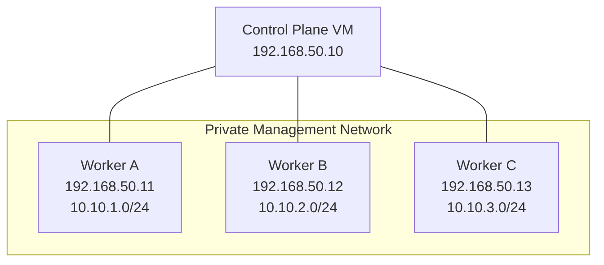

# Helixctl Development Guide

> Local development, Linux environment setup, build workflow, multi-node lab setup, and debugging conventions.

---

## 1. Development Model

Helixctl is a Linux systems project.

The user-facing CLI can be built on multiple platforms, but the Runtime and Network Manager depend on Linux kernel features.

For the full project, use Linux.

Recommended:

```text
Ubuntu Server 22.04+
```

---

# 2. Recommended Lab

A useful full cluster:



The Control Plane can also run on one of the worker hosts during early development, but keeping roles separate makes debugging easier.

---

# 3. VM Options

Possible choices:

```text
UTM
VirtualBox
VMware
cloud VMs
native Linux machines
```

The important requirement is:

- root access
- working cgroups v2
- private node-to-node networking
- ability to create veth/bridges/routes

Take VM snapshots before low-level experiments.

---

# 4. Required Knowledge

Useful prerequisites:

```text
Go
Linux shell
processes
TCP/IP
routing
filesystem basics
Docker usage
Git
```

You do not need to know how Docker/Kubernetes internals work before starting; the project is designed to build that understanding.

---

# 5. Go Toolchain

Use a current supported Go release.

Verify:

```bash
go version
```

The repository should pin the intended Go version in `go.mod`.

---

# 6. Protobuf Tooling

Internal gRPC development requires:

```text
protoc
protoc-gen-go
protoc-gen-go-grpc
```

Generated files go to:

```text
gen/proto/helix/v1/
```

Do not hand-edit generated code.

---

# 7. Useful Linux Packages

Depending on the environment:

```text
iproute2
util-linux
strace
tcpdump
bridge-utils or bridge command via iproute2
curl
make
```

Useful commands include:

```text
ip
bridge
unshare
nsenter
lsns
strace
tcpdump
```

---

# 8. cgroups v2 Check

Inspect:

```bash
stat -fc %T /sys/fs/cgroup
```

or:

```bash
mount | grep cgroup
```

The runtime design assumes cgroups v2.

---

# 9. IP Forwarding

For cross-node container routing:

```bash
sysctl net.ipv4.ip_forward
```

Expected:

```text
1
```

If needed in a disposable lab:

```bash
sudo sysctl -w net.ipv4.ip_forward=1
```

Permanent host configuration should be explicit rather than hidden in application code.

---

# 10. Management Network

Example lab:

```text
Control Plane: 192.168.50.10
Worker A:      192.168.50.11
Worker B:      192.168.50.12
Worker C:      192.168.50.13
```

Workers need direct management-network reachability.

---

# 11. Container CIDRs

Example:

```text
Worker A: 10.10.1.0/24
Worker B: 10.10.2.0/24
Worker C: 10.10.3.0/24
```

Do not choose CIDRs that conflict with the VM host network, VPN, or other routes in the lab.

---

# 12. Repository Layout

```text
helixctl/
├── cmd/
├── api/
├── gen/
├── internal/
├── tests/
├── scripts/
├── docs/
├── Makefile
├── go.mod
└── README.md
```

See the root README for the full package tree.

---

# 13. Binaries

The project builds three executables:

```text
helixctl
helixd
helix-agent
```

### `helixctl`

CLI client.

### `helixd`

Control Plane.

### `helix-agent`

Worker daemon.

---

# 14. Build

Example Make targets:

```bash
make build
```

or directly:

```bash
go build -o bin/helixctl ./cmd/helixctl
go build -o bin/helixd ./cmd/helixd
go build -o bin/helix-agent ./cmd/helix-agent
```

---

# 15. Format and Vet

Before committing:

```bash
gofmt -w .
go vet ./...
```

If the project adopts additional linters later, add them to the Makefile/CI rather than requiring undocumented local commands.

---

# 16. Generate Protobuf

Example future target:

```bash
make proto
```

Conceptually:

```text
api/proto/helix/v1/*.proto
    ↓
protoc
    ↓
gen/proto/helix/v1/
```

Generated output should be reproducible.

---

# 17. Run the Control Plane

Example:

```bash
./bin/helixd \
  --listen 0.0.0.0:8080 \
  --grpc-agent-timeout 5s
```

Exact flags may change as implementation develops.

Configuration should eventually support a file and/or environment variables.

---

# 18. Run a Worker Agent

Example:

```bash
sudo ./bin/helix-agent \
  --control-plane 192.168.50.10:9090 \
  --node-id node-a \
  --management-ip 192.168.50.11 \
  --container-cidr 10.10.1.0/24
```

The Agent needs elevated privileges for low-level runtime/network operations in the first version.

---

# 19. Use the CLI

Example:

```bash
./bin/helixctl node list
```

Run a workload:

```bash
./bin/helixctl container run \
  --name demo \
  --rootfs /opt/helix/rootfs/busybox \
  --cpu 500m \
  --memory 128m \
  -- /bin/sh -c "sleep 3600"
```

---

# 20. RootFS Preparation

The first runtime can use a prebuilt minimal BusyBox rootfs placed somewhere such as:

```text
/opt/helix/rootfs/busybox
```

The exact rootfs build/download method should be scripted once the runtime implementation is ready.

Do not make Runtime code depend on downloading images from the internet.

---

# 21. Start Small

Recommended development progression:

```text
single Linux VM
    ↓
single isolated process
    ↓
cgroups
    ↓
rootfs
    ↓
local networking
    ↓
Agent
    ↓
Control Plane
    ↓
multiple VMs
```

Do not start with the full three-node cluster before the local Runtime works.

---

# 22. Manual Namespace Experiments

Before debugging Go code, verify kernel behavior manually.

Examples:

```bash
sudo unshare --uts --pid --mount --fork /bin/bash
```

Inspect:

```bash
lsns
```

This separates Linux-understanding problems from Go-implementation problems.

---

# 23. Manual Network Experiments

Create a namespace/veth manually before implementing automation.

Use:

```text
ip netns
ip link
ip addr
ip route
bridge
```

The final code should automate known-working Linux behavior.

---

# 24. Logging

Run components with structured logs.

When debugging distributed flows, always preserve:

```text
request_id
node_id
container_id
operation
```

This makes it possible to follow one workload across processes.

---

# 25. Runtime Debugging

Useful:

```bash
strace -f ./bin/helix-agent ...
lsns
nsenter
cat /proc/<pid>/status
ls -la /proc/<pid>/ns/
findmnt
```

---

# 26. Network Debugging

Useful:

```bash
ip netns list
ip link
ip addr
ip route
bridge link
bridge fdb show
tcpdump
```

If same-node works but cross-node fails, inspect:

```text
host routes
IP forwarding
firewall forwarding
return path
```

---

# 27. DNS Debugging

When direct IP connectivity works but service names fail:

- inspect service registry
- inspect healthy endpoints
- verify DNS listener
- verify container resolver
- query the exact cluster name

Example:

```text
auth.service.cluster
```

---

# 28. Development Safety

The project changes Linux kernel networking and process-isolation state.

Use disposable VMs.

Avoid experimenting as root on a host that contains important workloads.

Keep snapshots.

---

# 29. Config Organization

Configuration belongs under:

```text
internal/config/
```

Examples:

```text
REST listen address
Agent gRPC address
Control Plane address
heartbeat interval
health timeout
bridge name
container CIDR
DNS address
runtime rootfs base
```

Do not scatter environment-variable parsing across unrelated packages.

---

# 30. Graceful Shutdown

Development runs should be stoppable with:

```text
SIGINT / SIGTERM
```

Components should share a root context and close cleanly.

Agents should not automatically destroy all running containers merely because the Agent process is stopping unless explicit lifecycle semantics require it.

---

# 31. Test Commands

Normal:

```bash
go test ./...
```

Race:

```bash
go test -race ./...
```

Privileged runtime/network tests should be clearly tagged or separated so ordinary tests do not unexpectedly require root.

---

# 32. Suggested Makefile Targets

```text
make build
make test
make test-race
make proto
make fmt
make vet
make smoke
make clean
```

Keep the Makefile as a convenience layer over understandable commands.

---

# 33. Git Workflow

Keep commits focused.

Examples:

```text
runtime: add UTS namespace setup
network: add veth pair lifecycle
controlplane: add least-load scheduler
discovery: filter unhealthy endpoints
```

Avoid one huge commit that implements several unrelated subsystems.

---

# 34. Documentation Updates

If a change modifies an architecture contract, update the matching document.

Examples:

```text
Runtime behavior -> RUNTIME.md
Routing -> NETWORKING.md
Scheduling -> CONTROL_PLANE.md
API -> API.md
Security boundary -> SECURITY.md
```

Major design changes may need an ADR.

---

# 35. Development Sequence

The canonical milestone order is documented in [`ROADMAP.md`](ROADMAP.md).

The main rule is:

> Build one vertical capability until it is observable and testable before stacking the next layer.

---

# 36. Ready-to-Develop Checklist

Before implementing low-level runtime code:

- [ ] Linux VM available
- [ ] VM snapshot created
- [ ] Go installed
- [ ] cgroups v2 verified
- [ ] root access available
- [ ] `ip`, `bridge`, `nsenter`, `unshare`, `strace` installed
- [ ] private VM network works
- [ ] chosen container CIDRs do not conflict
- [ ] repository builds
- [ ] ordinary unit tests run
