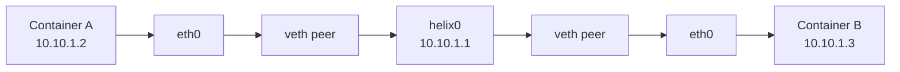
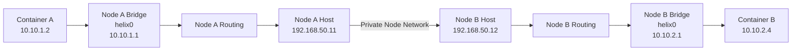
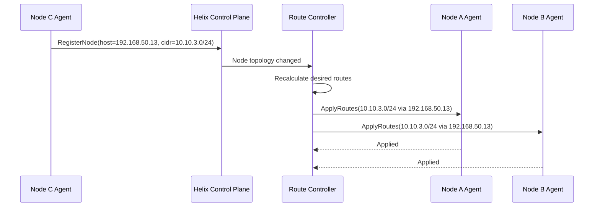
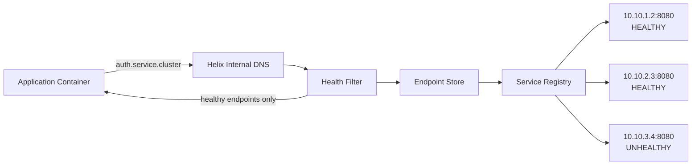
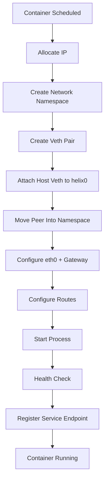
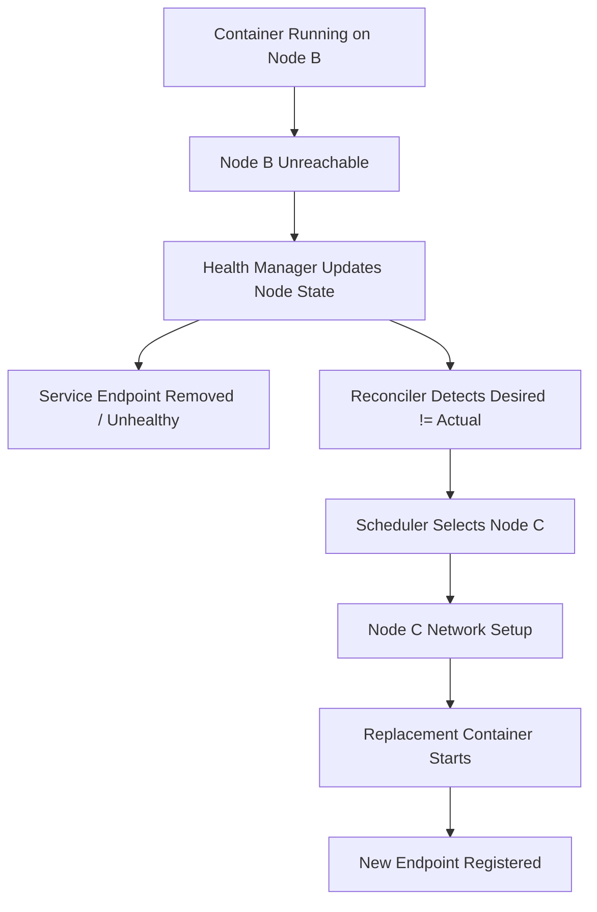

# Helixctl Networking

> Deep technical design for container networking, node routing, IP allocation, service discovery, and failure handling inside Helixctl.

---

## 1. Why This File Exists

The main `ARCHITECTURE.md` explains the entire Helixctl system.

This file focuses only on the networking side.

I wanted the networking layer to be documented separately because it is not just one small runtime feature. It is a complete subsystem with its own responsibilities:

- container network namespaces
- veth pairs
- Linux bridges
- IP allocation
- node CIDRs
- inter-node routing
- route distribution
- service discovery
- internal DNS
- health-aware endpoints
- cleanup
- recovery
- packet-level debugging

The goal is to keep the packet path visible and understandable.

I am not using Docker networking, Kubernetes CNI, or an overlay network in the first version. I want Helixctl to build the important Linux networking pieces directly.

---

# 2. Networking Goals

The first complete networking implementation should support all of the following:

- every container gets its own network namespace
- every container gets its own virtual interface
- containers on the same node can communicate
- containers on different nodes can communicate
- every node owns a unique container CIDR
- container IPs are allocated automatically
- routes are distributed automatically when nodes join
- routes are removed when nodes are removed
- containers can reach services by stable names
- service discovery returns only healthy endpoints
- workload rescheduling can update service endpoints
- networking can be inspected using standard Linux tools

---

# 3. Networking Mental Model

```text
Container
   |
   | eth0
   v
veth peer
   |
   v
host-side veth
   |
   v
Linux bridge
   |
   v
host routing table
   |
   v
node network
   |
   v
remote host routing
   |
   v
remote bridge
   |
   v
remote veth
   |
   v
remote container
```

For same-node communication, the packet does not need to leave the host.

For cross-node communication, the packet uses normal Linux L3 routing between node container CIDRs.

---

# 4. Core Networking Components

```text
Helix Network Manager
├── Network Namespace Manager
├── Veth Manager
├── Bridge Manager
├── IPAM
└── Route Manager

Helix Control Plane
├── Route Controller
└── Service Discovery
```

Each component has a narrow responsibility.

---

# 5. Why Networking Is Separate from the Runtime

The runtime is responsible for:

```text
process isolation
resource isolation
root filesystem
process lifecycle
```

The network layer is responsible for:

```text
connectivity
addressing
routing
service reachability
```

The clean boundary is:

```text
Node Agent
   |
   +--> Runtime
   |
   +--> Network Manager
```

The Agent coordinates both.

The Runtime does not need to know how routes are distributed across the cluster.

The Network Manager does not need to know how `pivot_root` works.

---

# 6. Package Structure

```text
internal/network/
├── netns/
├── veth/
├── bridge/
├── ipam/
└── routing/
```

Service discovery is separate:

```text
internal/discovery/
├── registry/
├── endpoints/
├── health/
└── dns/
```

Control-plane route management is also separate:

```text
internal/controlplane/routes/
```

This keeps local kernel operations separate from cluster-level route decisions.

---

# 7. Network Namespace

Each container gets its own Linux network namespace.

That gives the container its own:

- network interfaces
- IP addresses
- routing table
- loopback interface
- sockets
- network device namespace

Conceptually:

```text
Host Network Namespace
├── eth0
├── helix0
└── veth-host-123

Container Network Namespace
├── lo
└── eth0
```

The container should not directly share the host's default network namespace.

---

# 8. Why Network Namespaces

Without a separate network namespace, every container process would use the host networking stack directly.

That would mean:

- no isolated interfaces
- no isolated routes
- no independent container IP
- no clean container network lifecycle

The network namespace is the isolation boundary that makes the rest of the container networking model possible.

---

# 9. Veth Pairs

A veth pair connects the container network namespace to the host.

A veth pair works like a virtual cable:

```text
veth-host <================> veth-container
```

Traffic entering one side exits the other side.

The host side remains in the host namespace.

The peer side is moved into the container network namespace and renamed to:

```text
eth0
```

Result:

```text
Host Namespace

veth-host-abc
      |
      | virtual link
      |
      v

Container Namespace

eth0
```

---

# 10. Linux Bridge

Each node has a Linux bridge.

The first design uses:

```text
helix0
```

as the default bridge name.

Example:

```text
Node A

helix0
├── veth-auth1
├── veth-api1
└── veth-worker1
```

The bridge behaves like a virtual Layer 2 switch for local container interfaces.

Containers attached to the same bridge can communicate locally.

---

# 11. Why a Linux Bridge

I am using a Linux bridge because it exposes the network path directly.

It can be inspected using:

```bash
bridge link
bridge fdb show
ip link show helix0
```

It also makes same-node container communication straightforward without adding an overlay network in the first version.

---

# 12. Local Node Network Layout

Example:

```text
Node A
Management IP: 192.168.50.11
Container CIDR: 10.10.1.0/24
Bridge: helix0
Bridge IP: 10.10.1.1
```

Containers:

```text
auth-1
10.10.1.2

payments-1
10.10.1.3

worker-1
10.10.1.4
```

Network:

```text
                Node A
        Management: 192.168.50.11

                helix0
             10.10.1.1
          /      |       \
         /       |        \
      veth     veth      veth
       |        |         |
10.10.1.2  10.10.1.3  10.10.1.4
 auth-1     payments-1    worker-1
```

---

# 13. Per-Node Container CIDRs

Every worker node owns a unique container subnet.

Example:

```text
Node A -> 10.10.1.0/24
Node B -> 10.10.2.0/24
Node C -> 10.10.3.0/24
```

A container scheduled on Node B receives an address from:

```text
10.10.2.0/24
```

not from another node's subnet.

---

# 14. Why Per-Node CIDRs

I chose one container CIDR per node because it keeps routing simple.

If I see:

```text
10.10.2.17
```

I know that address belongs to the node that owns:

```text
10.10.2.0/24
```

This lets the control plane calculate routes at subnet level instead of creating one host route for every container.

---

# 15. IPAM

Helixctl includes a small IP Address Management layer.

Responsibilities:

```text
AllocateIP()
ReleaseIP()
IsAllocated()
ListAllocated()
```

A node only allocates addresses from its assigned container CIDR.

Example:

```text
Node B CIDR:
10.10.2.0/24

Reserved:
10.10.2.0   network address
10.10.2.1   bridge/gateway
10.10.2.255 broadcast

Available:
10.10.2.2
10.10.2.3
10.10.2.4
...
```

---

# 16. IPAM State

The first version can keep node-local IPAM state in memory.

Conceptually:

```go
type Pool struct {
    CIDR      *net.IPNet
    Gateway   net.IP
    Allocated map[string]string
}
```

Example:

```text
ctr-auth-1     -> 10.10.2.2
ctr-payments-1 -> 10.10.2.3
ctr-worker-1   -> 10.10.2.4
```

The IPAM package owns allocation rules so callers do not manipulate address maps directly.

---

# 17. IP Allocation Flow

```text
Node Agent
    |
    v
Network Manager
    |
    v
IPAM.AllocateIP()
    |
    v
10.10.2.7
```

Cleanup:

```text
Container removed
    |
    v
Network Manager cleanup
    |
    v
IPAM.ReleaseIP()
```

---

# 18. Container Network Creation Flow

```text
Create container network namespace
    ↓
Allocate container IP
    ↓
Create veth pair
    ↓
Keep host side in host namespace
    ↓
Move peer side into container namespace
    ↓
Attach host-side veth to helix0
    ↓
Rename peer side to eth0
    ↓
Bring loopback UP
    ↓
Bring eth0 UP
    ↓
Assign container IP
    ↓
Configure default route
    ↓
Container networking ready
```

---

# 19. Detailed Interface Setup

```text
Host Namespace

helix0
10.10.2.1/24
    |
veth-host-123
    |
    +====================+
                         |
                         v

Container Namespace

eth0
10.10.2.7/24

default via 10.10.2.1
```

The container uses the bridge address as its local gateway.

---

# 20. Example Linux Commands

The final implementation should use Go/Linux APIs or netlink where practical, but these commands show the actual kernel operations being modeled.

```bash
ip netns add ctr-123

ip link add veth-host type veth peer name veth-container

ip link set veth-container netns ctr-123

ip link set veth-host master helix0
ip link set veth-host up

ip netns exec ctr-123 ip link set lo up
ip netns exec ctr-123 ip link set veth-container name eth0
ip netns exec ctr-123 ip addr add 10.10.2.7/24 dev eth0
ip netns exec ctr-123 ip link set eth0 up
ip netns exec ctr-123 ip route add default via 10.10.2.1
```

These commands are useful for manual debugging even if the final code uses netlink.

---

# 21. Same-Node Communication

```text
auth-1
10.10.1.2

api-1
10.10.1.3
```

Both connect to:

```text
helix0
```

Packet flow:

```text
auth-1
10.10.1.2
    |
   eth0
    |
   veth
    |
  helix0
    |
   veth
    |
   eth0
    |
10.10.1.3
 api-1
```

The packet does not need to leave the host.

---

# 22. Cross-Node Communication

Example:

```text
Node A
Container A
10.10.1.2

Node B
Container B
10.10.2.4
```

Management network:

```text
Node A: 192.168.50.11
Node B: 192.168.50.12
```

Packet flow:

```text
Container A
10.10.1.2
    |
    v
Node A helix0
    |
    v
Node A route table
    |
    | 10.10.2.0/24 via 192.168.50.12
    |
    v
Node A physical interface
    |
    v
Private Node Network
    |
    v
Node B physical interface
    |
    v
Node B route table
    |
    v
Node B helix0
    |
    v
Container B
10.10.2.4
```

---

# 23. Why I Am Using Routed Networking First

I considered:

```text
Manual static routes
Control-plane-managed routes
VXLAN overlay
BGP
```

The first complete Helixctl network uses:

```text
Control-plane-managed L3 routes
```

This keeps the Linux packet path visible while still allowing nodes to join dynamically.

---

# 24. Why Not Manual Static Routes

Manual static routing would require configuring every node by hand.

That does not fit the behavior I want from an orchestrator.

The route is still a normal Linux route, but Helixctl manages its lifecycle automatically.

---

# 25. Route Controller

The Helix Control Plane contains a Route Controller.

It maintains:

```text
Node ID
Management IP
Container CIDR
Route ownership
```

Example cluster view:

```text
node-a
host IP: 192.168.50.11
CIDR:    10.10.1.0/24

node-b
host IP: 192.168.50.12
CIDR:    10.10.2.0/24

node-c
host IP: 192.168.50.13
CIDR:    10.10.3.0/24
```

The Route Controller calculates which routes every node needs.

---

# 26. Route Distribution Flow

```text
Node C Agent
    |
    | RegisterNode
    | Host IP = 192.168.50.13
    | CIDR    = 10.10.3.0/24
    v
Helix Control Plane
    |
    v
Node Registry
    |
    v
Route Controller
    |
    +--> Node A needs 10.10.3.0/24 via 192.168.50.13
    |
    +--> Node B needs 10.10.3.0/24 via 192.168.50.13
    |
    v
ApplyRoutes() over gRPC
    |
    v
Node Agents
    |
    v
Linux Route Tables
```

---

# 27. Route Programming

Conceptual route:

```go
type Route struct {
    DestinationCIDR string
    NextHop         string
}
```

Example:

```text
Destination:
10.10.3.0/24

Next Hop:
192.168.50.13
```

The Node Agent passes route updates to the local Route Manager.

The Route Manager programs the Linux kernel route table.

---

# 28. Why Netlink

Linux networking is configured through netlink.

Using a Go netlink library gives direct access to kernel networking operations.

That is cleaner than building the system around shell commands.

The Linux CLI tools remain useful for inspection and debugging.

---

# 29. Route Lifecycle

## Node Join

```text
Node registers
    ↓
Container CIDR becomes known
    ↓
Route Controller recalculates desired routes
    ↓
Agents receive additions
```

## Node Removal

```text
Node removed
    ↓
CIDR ownership removed
    ↓
Route Controller recalculates routes
    ↓
Agents receive route deletion
```

## Temporary Node Failure

A route should not necessarily disappear after a single missed heartbeat.

A temporary network partition may recover.

Route withdrawal follows health policy.

---

# 30. Route Reconciliation

The Route Controller works in desired-state style.

```text
Desired Routes
vs
Actual Managed Routes
```

If a route is missing:

```text
add it
```

If an obsolete Helix-managed route exists:

```text
remove it
```

This is better than treating route configuration as a one-time event.

---

# 31. Why Not BGP Initially

BGP could distribute container CIDRs dynamically.

I am not using it in the first complete version because it introduces:

- BGP sessions
- route advertisements
- route withdrawals
- convergence
- peering
- routing policy

The Control Plane already knows cluster membership, so direct route distribution is enough initially.

BGP remains a future extension.

---

# 32. Why Not VXLAN Initially

VXLAN is also a valid future direction.

I am not using it initially because it adds:

- encapsulation
- tunnel endpoints
- VNIs
- MTU overhead
- overlay debugging
- additional packet-path complexity

The first routed design keeps the packet path visible.

---

# 33. Linux IP Forwarding

Cross-node traffic requires host packet forwarding.

Inspect:

```bash
sysctl net.ipv4.ip_forward
```

Expected:

```text
net.ipv4.ip_forward = 1
```

The Node Agent startup validation should check this.

---

# 34. Host Firewall Considerations

Routes can be correct while forwarding still fails because of host firewall rules.

Important areas:

```text
iptables
nftables
FORWARD chain
bridge filtering
host security policy
```

The first version should keep firewall handling explicit.

---

# 35. NAT

NAT is not required for direct container-to-container communication when all Helix container CIDRs are routed correctly.

NAT may be needed for container access to external networks depending on the environment.

Internal cluster networking and outbound internet access are separate concerns.

---

# 36. Routing vs Service Discovery

Routing answers:

> How do I reach this IP?

Service discovery answers:

> Which IP should I use?

These are different problems.

Applications should call:

```text
auth.service.cluster
```

rather than hardcoding:

```text
10.10.2.7
```

---

# 37. Service Discovery Components

```text
Service Registry
Endpoint Store
Health Filter
Internal DNS
```

Flow:

```text
Application
    |
    | DNS query
    v
Internal DNS
    |
    v
Health Filter
    |
    v
Endpoint Store
    |
    v
Service Registry
```

---

# 38. Service Registry

The Service Registry stores logical services.

Example:

```text
Service:
auth

Port:
8080
```

The service is a stable identity and is not permanently tied to a container or node.

---

# 39. Endpoint Store

Example:

```text
auth

10.10.1.4:8080
10.10.2.7:8080
10.10.3.9:8080
```

An endpoint should track:

```text
Service ID
Container ID
Node ID
IP
Port
Health
Last Update
```

---

# 40. Health Filter

Example:

```text
auth

10.10.1.4:8080 HEALTHY
10.10.2.7:8080 HEALTHY
10.10.3.9:8080 UNHEALTHY
```

DNS should return only:

```text
10.10.1.4
10.10.2.7
```

---

# 41. Internal DNS

Naming format:

```text
<service>.service.cluster
```

Examples:

```text
auth.service.cluster
payments.service.cluster
orders.service.cluster
```

A service can resolve to multiple healthy endpoints.

---

# 42. Multiple Replicas

```text
auth service

auth-1
Node A
10.10.1.2

auth-2
Node B
10.10.2.3

auth-3
Node C
10.10.3.4
```

DNS query:

```text
auth.service.cluster
```

can return:

```text
10.10.1.2
10.10.2.3
10.10.3.4
```

The first DNS implementation can rotate or randomize response ordering.

---

# 43. Service Registration Flow

```text
Container scheduled
    ↓
Container created
    ↓
IP assigned
    ↓
Process started
    ↓
Health check succeeds
    ↓
Endpoint becomes HEALTHY
    ↓
Service Registry updated
    ↓
DNS may return endpoint
```

---

# 44. Service Removal Flow

```text
Container exits
    ↓
Node Agent reports failure
    ↓
Endpoint marked unhealthy
    ↓
DNS stops returning endpoint
    ↓
Reconciler decides recovery
```

---

# 45. Rescheduling and Service Discovery

Before:

```text
auth
├── 10.10.1.4
└── 10.10.2.7
```

Node B fails and the workload is recreated on Node C:

```text
auth
├── 10.10.1.4
└── 10.10.3.5
```

The application continues using:

```text
auth.service.cluster
```

---

# 46. DNS Configuration Inside Containers

Containers must use the Helix internal DNS for cluster names.

Conceptually:

```text
/etc/resolv.conf

nameserver <helix-dns-ip>
```

The exact DNS deployment can begin simple and evolve later.

---

# 47. DNS Availability

The first version can run one internal DNS component associated with the Control Plane.

Later options:

```text
replicated DNS
node-local DNS caching
DNS forwarding
```

---

# 48. DNS and External Names

Helix DNS should own only the cluster-specific zone.

Example:

```text
auth.service.cluster
    ↓
Helix DNS

github.com
    ↓
upstream DNS
```

---

# 49. Container Network Lifecycle

## Create

```text
Allocate IP
Create netns
Create veth
Attach bridge
Configure interface
Configure routes
Mark network ready
```

## Running

```text
Maintain interface
Maintain IP ownership
Monitor container health
```

## Remove

```text
Delete veth
Remove namespace
Release IP
Remove service endpoint
Clean network state
```

Cleanup should be idempotent.

---

# 50. Idempotent Cleanup

If cleanup is requested but some resource is already missing, the network manager should converge toward:

```text
resource absent
```

rather than fail simply because the resource is already gone.

This is important during partial failures.

---

# 51. Linux Interface Naming

Linux interface names have length limits.

The implementation should use short unique names.

Example:

```text
hx1234a
hx1234b
```

The container-facing interface remains:

```text
eth0
```

The bridge remains:

```text
helix0
```

---

# 52. Network State Model

Conceptually:

```go
type ContainerNetwork struct {
    ContainerID string
    NodeID      string

    Namespace   string

    IPAddress   string
    Gateway     string
    CIDR        string

    HostVeth    string
    PeerVeth    string
    Bridge      string
}
```

---

# 53. Route Model

```go
type Route struct {
    DestinationCIDR string
    NextHop         string
    Device          string
    OwnerNodeID     string
}
```

The Route Controller owns desired route state.

The local Route Manager owns kernel programming.

---

# 54. Network Manager Interface

```go
type NetworkManager interface {
    SetupContainer(
        ctx context.Context,
        spec ContainerNetworkSpec,
    ) (ContainerNetwork, error)

    RemoveContainer(
        ctx context.Context,
        containerID string,
    ) error

    ApplyRoutes(
        ctx context.Context,
        routes []Route,
    ) error

    InspectContainer(
        ctx context.Context,
        containerID string,
    ) (ContainerNetwork, error)
}
```

The Node Agent calls this interface instead of manipulating veths or bridges directly.

---

# 55. IPAM Interface

```go
type IPAM interface {
    Allocate(containerID string) (net.IP, error)
    Release(containerID string) error
    Lookup(containerID string) (net.IP, bool)
}
```

---

# 56. Route Manager Interface

```go
type RouteManager interface {
    Reconcile(ctx context.Context, desired []Route) error
    ListManaged(ctx context.Context) ([]Route, error)
}
```

I prefer reconciliation over one-time route mutation because kernel state can drift.

---

# 57. Network Setup Transaction

Network setup has multiple steps.

Example:

```text
IP allocated
    ↓
veth created
    ↓
bridge attach fails
```

The system should clean up resources created by earlier successful steps.

Conceptually:

```text
Step 1 succeeds
Step 2 succeeds
Step 3 fails
    ↓
rollback Step 2
rollback Step 1
```

This prevents leaked IPs, interfaces, and namespaces.

---

# 58. Failure: IP Allocation Exhausted

If a node has no free container IPs:

```text
AllocateIP()
    ↓
ErrPoolExhausted
```

The Agent should fail network creation clearly.

Later, scheduling can become aware of available IP capacity.

---

# 59. Failure: Veth Creation Fails

Possible causes:

- insufficient privileges
- interface name collision
- kernel/network error

The Network Manager should:

```text
return detailed error
release allocated IP
remove partially created resources
```

---

# 60. Failure: Bridge Missing

I prefer Agent startup to ensure `helix0` exists before the node becomes ready.

That keeps per-container setup simpler.

If the bridge cannot be created, the node should not advertise itself as fully network-ready.

---

# 61. Failure: Route Update Fails

The Agent should report route programming failures.

The Route Controller should retry through reconciliation.

The failure should be observable through:

```text
logs
metrics
node network status
```

---

# 62. Failure: Node Disappears

When a node becomes unreachable:

```text
Node health -> UNREACHABLE
```

The Route Controller may eventually withdraw the node's route.

Service discovery should stop returning endpoints on that node.

The Reconciler may schedule replacements elsewhere.

---

# 63. Network Partition Problem

A node can be alive while disconnected from the Control Plane.

This creates ambiguity.

The Control Plane may reschedule a workload while the original instance is still alive.

This is not fully solved in the first version.

Future protections can include:

- leases
- fencing
- workload generations
- ownership tokens
- consensus-backed state

---

# 64. Stale Routes

The controller periodically compares:

```text
Desired Helix Routes
vs
Actual Managed Routes
```

and corrects differences.

---

# 65. Stale Service Endpoints

Endpoint validity depends on:

```text
container state
node health
endpoint health
```

An endpoint should not remain discoverable just because it was once registered.

---

# 66. Observability

Important log fields:

```text
component
node_id
container_id
interface
namespace
ip
cidr
route
next_hop
service
endpoint
operation
duration
error
```

Example:

```text
component=network
node_id=node-b
container_id=ctr-123
operation=create_veth
state=failed
error="operation not permitted"
```

---

# 67. Networking Metrics

Useful metrics:

```text
network_setup_total
network_setup_failures_total
network_setup_duration_seconds

ip_allocations_total
ip_allocation_failures_total
ip_pool_available

route_updates_total
route_update_failures_total

service_endpoints_healthy
service_endpoints_unhealthy

dns_queries_total
dns_query_failures_total
```

---

# 68. Debugging Commands

```bash
ip netns list
ip link
ip addr
ip route
bridge link
bridge fdb show
```

Inside namespace:

```bash
ip netns exec <namespace> ip addr
ip netns exec <namespace> ip route
```

Using a process PID:

```bash
nsenter -t <pid> -n ip addr
```

---

# 69. Packet Debugging

Useful tools:

```text
ping
traceroute
tcpdump
ss
ip neigh
arp
```

Examples:

```bash
tcpdump -i helix0
tcpdump -i eth0
ip netns exec <namespace> tcpdump -i eth0
```

---

# 70. Debugging Same-Node Failure

Check:

```text
Are both interfaces UP?
Are addresses correct?
Are host veths attached to helix0?
Is the bridge UP?
Are there conflicting IPs?
Are firewall rules blocking traffic?
```

---

# 71. Debugging Cross-Node Failure

Check:

```text
node container CIDRs
host routes
IP forwarding
management network reachability
firewall forwarding
return path
```

A working forward route without a working return route is still broken connectivity.

---

# 72. Debugging Service Discovery Failure

If direct IP connectivity works but the service name fails, inspect:

```text
service exists
endpoint exists
endpoint is healthy
DNS is reachable
container resolver points to Helix DNS
service name is correct
```

---

# 73. Same-Node Test

```text
Node A
├── container-1 10.10.1.2
└── container-2 10.10.1.3
```

Expected:

```text
container-1 -> container-2 succeeds
container-2 -> container-1 succeeds
```

This validates:

```text
netns
veth
bridge
IPAM
```

---

# 74. Cross-Node Test

```text
Node A
container-1
10.10.1.2

Node B
container-2
10.10.2.2
```

Expected:

```text
10.10.1.2 -> 10.10.2.2 succeeds
10.10.2.2 -> 10.10.1.2 succeeds
```

This additionally validates:

```text
route distribution
host forwarding
underlay connectivity
return routing
```

---

# 75. Service Discovery Test

Create:

```text
auth
```

with:

```text
auth-1 -> 10.10.1.2
auth-2 -> 10.10.2.2
```

Query:

```text
auth.service.cluster
```

Expected:

```text
10.10.1.2
10.10.2.2
```

Mark one endpoint unhealthy.

Expected:

```text
only healthy endpoint is returned
```

---

# 76. Rescheduling Test

Initial:

```text
auth-1
Node A
10.10.1.2
```

Make Node A unavailable.

Expected:

```text
Node A becomes unhealthy
    ↓
old endpoint removed from discovery
    ↓
workload recreated on Node B
    ↓
new IP allocated
    ↓
new endpoint becomes healthy
    ↓
DNS returns new endpoint
```

The caller continues using:

```text
auth.service.cluster
```

---

# 77. Route Join Test

Start:

```text
Node A
Node B
```

Verify each has a route to the other's container CIDR.

Add Node C.

Expected:

```text
Node A gets Node C route
Node B gets Node C route
Node C gets Node A route
Node C gets Node B route
```

without manual route configuration.

---

# 78. Route Removal Test

Remove Node C.

Expected:

```text
Node C CIDR ownership removed
route reconciliation runs
Node A removes Node C route
Node B removes Node C route
```

---

# 79. Network Cleanup Test

Create and remove a container repeatedly.

Verify:

```text
no leaked netns
no leaked veth
IP returned to pool
service endpoint removed
no stale per-container state
```

---

# 80. Race Testing

Concurrency-sensitive areas include:

```text
two containers allocating IPs at once
route reconciliation while a node joins
endpoint update while health changes
container cleanup while Agent reports state
```

Run:

```bash
go test -race ./...
```

---

# 81. Startup Validation

Before a Node Agent reports READY, it should validate:

```text
Linux environment
required privileges
bridge exists or can be created
container CIDR is valid
CIDR does not conflict locally
IP forwarding is enabled
management interface exists
```

---

# 82. Node Health vs Network Readiness

A node can be alive while container networking is broken.

Example:

```text
Node Health:
HEALTHY

Network:
NOT_READY
```

The scheduler should avoid nodes that cannot provide required networking.

---

# 83. Management Network vs Container Network

Example:

```text
Management Network:
192.168.50.0/24

Container Networks:
10.10.1.0/24
10.10.2.0/24
10.10.3.0/24
```

Management network:

```text
Control Plane <-> Node Agent
route next hops
```

Container network:

```text
container-to-container traffic
service traffic
```

---

# 84. Control Plane Traffic

gRPC communication uses node management addresses.

Example:

```text
helixd
    |
    | gRPC
    v
192.168.50.12:<agent-port>
```

It should not depend on the container network.

---

# 85. MTU

The first routed network avoids overlay encapsulation, so MTU handling is simpler than VXLAN.

Container veth MTU should be compatible with the host network.

If VXLAN is added later, encapsulation overhead must be considered.

---

# 86. IPv4 First

The first complete network uses IPv4.

That keeps:

```text
CIDR allocation
routing
DNS A records
debugging
```

simpler.

IPv6 can be added later.

---

# 87. Security Boundary

The first version assumes a trusted lab cluster.

It is not a zero-trust network.

Future additions can include:

```text
network policies
mTLS
service identity
traffic filtering
encrypted overlays
```

---

# 88. What I Am Not Using Initially

```text
Docker networking
Kubernetes CNI
Flannel
Calico
Cilium
VXLAN
BGP
eBPF dataplane
service mesh
Envoy
advanced network policy
IPv6
```

This is intentional.

The goal is to understand the base Linux networking path first.

---

# 89. Future Networking Extensions

## VXLAN Overlay

```text
node bridge
    ↓
VXLAN tunnel
    ↓
remote node bridge
```

## BGP Route Distribution

Nodes can later advertise their container CIDRs instead of receiving direct route updates from the Control Plane.

## eBPF Dataplane

I can later explore replacing parts of traditional networking with eBPF.

## Network Policies

Example:

```text
frontend may call backend
frontend may not call database directly
```

## Service Load Balancing

A later version can add a stable virtual service address or proxy instead of returning endpoint IPs directly.

---

# 90. Networking Implementation Order

## Stage 1 — One Network Namespace

- create netns
- attach a process
- bring loopback up
- inspect it manually

## Stage 2 — One Veth Pair

- create veth
- move peer into netns
- assign IP
- test host-to-container

## Stage 3 — Linux Bridge

- create `helix0`
- attach multiple veths
- test same-node container communication

## Stage 4 — IPAM

- node CIDR
- allocate/release
- prevent duplicate addresses

## Stage 5 — Node Networking Integration

- Network Manager interface
- lifecycle integration
- cleanup

## Stage 6 — Cross-Node Routing

- management addresses
- per-node CIDRs
- route programming
- forwarding
- return-path validation

## Stage 7 — Route Controller

- node registration integration
- desired route calculation
- `ApplyRoutes()` over gRPC
- route reconciliation

## Stage 8 — Service Registry

- logical services
- endpoints
- health state

## Stage 9 — Internal DNS

- stable service names
- multiple healthy endpoints
- endpoint removal after failure

## Stage 10 — Failure Testing

- node failure
- rescheduling
- route changes
- endpoint replacement
- cleanup

---

# 91. Networking Definition of Done

- [ ] Every container gets its own network namespace.
- [ ] Every container gets a veth pair.
- [ ] Host-side veth interfaces attach to `helix0`.
- [ ] Every node owns a unique container CIDR.
- [ ] IPAM allocates unique container addresses.
- [ ] IPs are released on container removal.
- [ ] Containers on the same node can communicate.
- [ ] Containers on different nodes can communicate.
- [ ] Linux IP forwarding is validated.
- [ ] Routes are distributed automatically by the Route Controller.
- [ ] Route changes are reconciled.
- [ ] Node join adds required routes.
- [ ] Node removal withdraws obsolete routes.
- [ ] Services contain one or more endpoints.
- [ ] Only healthy endpoints are discoverable.
- [ ] Internal DNS resolves stable service names.
- [ ] Rescheduling updates service endpoints.
- [ ] Cleanup does not leak veths, namespaces, or IP allocations.
- [ ] Networking can be debugged using standard Linux tools.

---

# 92. Complete Same-Node Diagram



---

# 93. Complete Cross-Node Diagram



Node A route:

```text
10.10.2.0/24 via 192.168.50.12
```

Node B route:

```text
10.10.1.0/24 via 192.168.50.11
```

---

# 94. Route Distribution Diagram



---

# 95. Service Discovery Diagram



---

# 96. Full Network Lifecycle Diagram



---

# 97. Failure and Recovery Diagram



---

# 98. Final Networking Model

```text
Each Node
    |
    +-- one management IP
    |
    +-- one container CIDR
    |
    +-- one Helix bridge
    |
    +-- multiple container veths
    |
    +-- one local IPAM pool
    |
    +-- Helix-managed routes to remote container CIDRs
```

Cluster-level networking:

```text
Node Registration
    ↓
CIDR Ownership
    ↓
Route Controller
    ↓
Route Distribution
    ↓
Linux Routing
```

Application-level discovery:

```text
Service Name
    ↓
Internal DNS
    ↓
Healthy Endpoints
    ↓
Container IPs
```

---

# 99. Final Design Statement

The Helixctl networking layer is intentionally built from Linux primitives instead of using an existing container networking stack.

I am using:

```text
network namespaces
veth pairs
Linux bridges
per-node CIDRs
IPAM
Linux routing
control-plane-managed route distribution
service registry
health-aware endpoints
internal DNS
```

The first version uses direct L3 routing between node container CIDRs because it keeps the packet path visible and teaches the networking fundamentals that overlay solutions usually hide.

VXLAN, BGP, eBPF, network policy, and advanced service load balancing are left as later extensions.

The important goal is that I can explain and debug the complete path:

```text
container
→ interface
→ veth
→ bridge
→ route
→ node network
→ remote route
→ bridge
→ veth
→ container
```

and also explain how applications find each other without depending on unstable container IP addresses.
