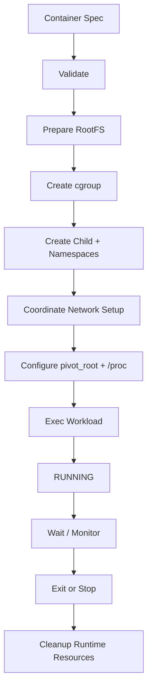
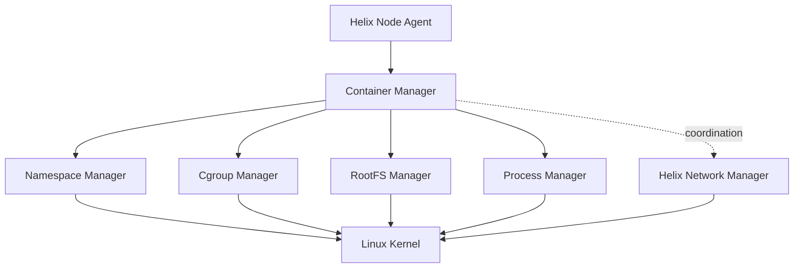

# Helixctl Runtime

> Design for the Linux container execution layer used by every Helix worker node.

---

## 1. Purpose

The Helix Runtime is the part of the project that turns a workload specification into an isolated Linux process.

I am not using Docker, containerd, or `runc` to create the container for the core runtime path. The point of this subsystem is to work directly with the Linux primitives that container runtimes are built on.

A Helix container is modeled as:

```text
Linux Process
+ PID Namespace
+ UTS Namespace
+ Mount Namespace
+ Network Namespace
+ cgroups v2
+ Root Filesystem
+ Process Lifecycle
```

Networking is coordinated with the Helix Network Manager and is documented separately in [`NETWORKING.md`](NETWORKING.md).

The cluster-level decision about **where** a container should run belongs to the Control Plane. The Runtime only knows how to execute a container on the local Linux host.

---

# 2. Runtime Boundary

The runtime sits below the Node Agent:

```text
Helix Control Plane
        |
       gRPC
        |
        v
Helix Node Agent
        |
        v
Helix Runtime
        |
        v
Linux Kernel
```

The Runtime must not know:

- how many nodes exist
- which scheduling policy is active
- where the Control Plane runs
- how service discovery works
- whether another replica exists
- why this node was selected

It receives a local execution specification and performs local work.

---

# 3. Runtime Responsibilities

The Runtime owns:

- container identity on the local node
- namespace creation
- cgroup creation and resource limits
- root filesystem preparation
- mount setup
- `pivot_root`
- child process creation
- PID tracking
- signals and termination
- exit-status collection
- local cleanup
- runtime inspection
- partial-failure rollback

It collaborates with the Network Manager for:

- network namespace configuration
- veth setup
- container IP assignment
- bridge attachment

---

# 4. Runtime Package Structure

```text
internal/runtime/
├── container/
├── namespace/
├── cgroup/
├── rootfs/
└── process/
```

### `container/`

Coordinates the complete local lifecycle. It is the package that composes namespaces, cgroups, rootfs, networking coordination, and process execution.

### `namespace/`

Owns Linux namespace flags, namespace creation, joining, and inspection.

### `cgroup/`

Owns cgroups v2 creation, resource configuration, PID attachment, metrics, and cleanup.

### `rootfs/`

Owns root filesystem preparation, mount isolation, `/proc` setup, `pivot_root`, and cleanup.

### `process/`

Owns child process creation, PID tracking, signal delivery, waiting, exit status, and process reaping.

---

# 5. Runtime Interface

The Node Agent should call a high-level interface rather than individual Linux managers.

A possible boundary:

```go
type Runtime interface {
    Create(ctx context.Context, spec ContainerSpec) (Container, error)
    Start(ctx context.Context, id string) error
    Stop(ctx context.Context, id string, timeout time.Duration) error
    Remove(ctx context.Context, id string) error
    Inspect(ctx context.Context, id string) (Container, error)
    List(ctx context.Context) ([]Container, error)
}
```

The exact API can evolve, but the important rule is that Agent code must not directly call:

```text
namespace.Create()
cgroup.Write()
pivotRoot()
```

Those are Runtime implementation details.

---

# 6. Container Specification

A local runtime request needs enough information to construct the process.

Conceptually:

```go
type ContainerSpec struct {
    ID      string
    Name    string
    RootFS  string

    Command string
    Args    []string
    Env     []string

    Hostname string

    CPUQuota   int64
    MemoryMax  int64

    WorkingDir string
}
```

Networking data can either be passed as a separate network specification or coordinated by the Node Agent.

The runtime should avoid embedding cluster objects such as service replicas or scheduler scores in this structure.

---

# 7. Container Runtime State

The local runtime tracks states such as:

```text
CREATING
CREATED
RUNNING
STOPPING
STOPPED
FAILED
```

The Control Plane has its own workload state model. The local Runtime state is specifically about the process on this node.

Example:

```text
Control Plane:
Desired = RUNNING

Node Runtime:
Actual = RUNNING
PID    = 4821
```

---

# 8. Process Creation Model

The initial implementation uses Go process APIs plus Linux namespace flags.

Conceptually:

```go
cmd := exec.Command(command, args...)

cmd.SysProcAttr = &syscall.SysProcAttr{
    Cloneflags:
        syscall.CLONE_NEWPID |
        syscall.CLONE_NEWUTS |
        syscall.CLONE_NEWNS |
        syscall.CLONE_NEWNET,
}
```

The exact implementation may use `syscall` or `golang.org/x/sys/unix` depending on the syscall being exercised.

The important learning goal is understanding what the kernel creates when these flags are used.

---

# 9. Parent and Child Responsibilities

Container creation is easier to reason about when parent-side and child-side responsibilities are explicit.

```text
Parent / Helix Runtime
    |
    +-- validate spec
    +-- prepare rootfs
    +-- prepare cgroup
    +-- create child with namespaces
    +-- coordinate network setup
    +-- attach child to cgroup
    +-- track PID
    |
    v
Container Child
    |
    +-- configure hostname
    +-- configure mounts
    +-- pivot_root
    +-- mount /proc
    +-- set working directory
    +-- exec workload
```

Some steps may require synchronization so the child does not execute the workload before the parent finishes required setup.

---

# 10. Namespace Set

The first complete runtime uses four namespaces.

## PID Namespace

Purpose:

```text
process tree isolation
```

The container should not see the host's complete process tree.

Inside the namespace, the workload or an init shim may appear as PID 1.

Important consequence:

PID 1 has special signal/reaping behavior on Linux.

---

## UTS Namespace

Purpose:

```text
hostname isolation
```

A container can have a hostname independent of the host.

Example:

```text
host hostname:
worker-a

container hostname:
auth-7f82
```

---

## Mount Namespace

Purpose:

```text
mount-table isolation
```

The container can receive a different root filesystem and mount layout without changing the host mount table.

This namespace is required for the rootfs and `pivot_root` design.

---

## Network Namespace

Purpose:

```text
network-stack isolation
```

The network namespace gives the container its own interfaces and routes.

The detailed setup is owned by the Network Manager.

---

# 11. Future Namespaces

Later runtime work can include:

```text
IPC Namespace
USER Namespace
```

### IPC

Useful for isolating System V IPC and POSIX message queues.

### USER

Useful for UID/GID remapping and rootless/container security work.

USER namespaces are deliberately not required in the first rootful implementation.

---

# 12. cgroups v2

Namespaces control visibility and isolation.

cgroups control resource usage.

The first complete Runtime uses cgroups v2 for:

- memory limits
- CPU limits
- PID attachment
- resource inspection

Conceptual hierarchy:

```text
/sys/fs/cgroup/helix/
└── <container-id>/
    ├── memory.max
    ├── cpu.max
    └── cgroup.procs
```

---

# 13. Memory Limit

Example:

```text
memory.max = 134217728
```

for a 128 MiB limit.

The Runtime must:

1. create the container cgroup
2. configure `memory.max`
3. place the container PID into `cgroup.procs`

The implementation should expose clear errors for:

- unsupported controller
- permission failure
- invalid limit
- cgroup path failure

---

# 14. CPU Limit

`cpu.max` can represent a quota and period.

Example conceptual limit:

```text
50000 100000
```

which means the cgroup can consume 50 ms of CPU time per 100 ms period.

The CLI can expose human-friendly units while the Runtime translates them into cgroup values.

---

# 15. cgroup Cleanup

Container removal should attempt to:

```text
stop process
remove PID from active workload
remove cgroup directory
```

Cleanup must be idempotent.

If the process has already exited or the cgroup is already missing, cleanup should converge toward the final desired condition rather than fail unnecessarily.

---

# 16. Root Filesystem

The first runtime uses a minimal BusyBox-compatible root filesystem.

Example layout:

```text
rootfs/
├── bin/
├── dev/
├── etc/
├── proc/
├── sys/
├── tmp/
└── usr/
```

The first implementation does not require full OCI image pulling.

The rootfs can be prepared manually or by project scripts.

---

# 17. Why BusyBox First

BusyBox keeps the first root filesystem:

- small
- understandable
- easy to inspect
- easy to copy into a VM
- sufficient for shell-based verification

The goal is to validate process/filesystem isolation before implementing an image-management subsystem.

---

# 18. `chroot` vs `pivot_root`

`chroot` can be useful for an early proof of concept.

The final runtime path should use:

```text
pivot_root
```

because it works naturally with a private mount namespace and replaces the process root more completely.

Recommended learning progression:

```text
working chroot prototype
        ↓
understand mount namespace
        ↓
implement pivot_root
```

---

# 19. Mount Propagation

Before manipulating the container root, the mount namespace should avoid accidentally propagating mount changes back to the host.

A typical design makes the relevant mount tree private.

Conceptually:

```text
host mounts
    X
container private mount changes
```

This is an important detail when experimenting with mount namespaces.

---

# 20. `pivot_root` Flow

Conceptual sequence:

```text
new rootfs prepared
    ↓
bind-mount rootfs onto itself if required
    ↓
create old-root directory
    ↓
pivot_root(newRoot, oldRoot)
    ↓
chdir("/")
    ↓
unmount old root
    ↓
remove old-root directory
```

The exact syscall behavior should be tested manually inside a VM before being hidden behind Runtime helpers.

---

# 21. `/proc`

A new PID namespace needs an appropriate `/proc` mounted from inside the container's mount namespace.

Otherwise commands such as:

```bash
ps
```

may show misleading process information.

The Runtime should mount `/proc` after entering the new PID/mount environment.

---

# 22. `/dev` and `/sys`

The first implementation should keep device exposure minimal.

The project does not need to recreate all Docker device handling immediately.

Any mount or bind mount into `/dev` or `/sys` should be explicit because it affects the isolation boundary.

---

# 23. Working Directory and Environment

Before executing the workload:

- set environment variables
- validate working directory
- change working directory
- set hostname where required
- prepare command and args

A bad working directory should fail before the application process starts.

---

# 24. Process Start

The Runtime should distinguish:

```text
container object created
```

from:

```text
container process started
```

Even if the initial implementation combines them internally, the model should keep lifecycle steps explicit.

This makes later pause/start/restart behavior easier to add.

---

# 25. PID Tracking

The host PID is important for:

- signals
- inspection
- namespace access
- `nsenter`
- exit monitoring
- cgroup checks

Example local runtime state:

```text
Container ID: ctr-123
Host PID:     4821
State:        RUNNING
```

The host PID must not be confused with the PID visible inside the container namespace.

---

# 26. PID 1 Behavior

If the workload becomes PID 1 inside the container namespace, it has special responsibilities.

PID 1 needs to handle:

- orphaned child reaping
- signal semantics

A future version may introduce a very small Helix init shim if required.

The first version can begin with simple workloads while this behavior is understood.

---

# 27. Signals

Stopping a container should normally follow a graceful sequence:

```text
SIGTERM
    ↓
wait grace period
    ↓
SIGKILL if still running
```

The timeout should be configurable.

The Runtime should return enough information for the Agent to report whether termination was graceful or forced.

---

# 28. Process Reaping

The Runtime or an init process must ensure exited child processes are reaped.

Ignoring this can create zombies.

This becomes especially important when the container workload launches additional child processes.

---

# 29. Exit Status

When the process exits, capture:

```text
exit code
signal if applicable
timestamp
```

Example:

```text
exit_code = 1
```

or:

```text
terminated_by = SIGKILL
```

This information is reported to the Node Agent and then to the Control Plane.

---

# 30. Runtime and Networking Coordination

Container creation needs cooperation between Runtime and Network Manager.

A useful sequence is:

```text
Runtime prepares container
    ↓
network namespace exists
    ↓
Network Manager configures netns
    ↓
Runtime starts final workload
```

The exact synchronization mechanism can evolve, but the workload should not begin normal execution before its required network setup is complete.

See [`NETWORKING.md`](NETWORKING.md) for the network lifecycle.

---

# 31. Partial Failure Rollback

Container creation is multi-step.

Example:

```text
rootfs prepared
cgroup created
namespace child started
network setup fails
```

The Runtime must clean up the resources it already owns.

Rollback should cover:

- child process
- cgroup
- temporary mounts
- rootfs mounts
- runtime objects

The Network Manager handles rollback for the network resources it owns.

---

# 32. Idempotent Removal

`Remove(containerID)` may be called after:

- normal stop
- process crash
- partial create failure
- Agent restart
- repeated cleanup attempts

The final desired condition is:

```text
container runtime resources absent
```

Missing resources should generally be treated as already-clean rather than as fatal cleanup errors.

---

# 33. Runtime Inspection

`Inspect()` should expose useful local information:

```text
Container ID
State
Host PID
Command
RootFS
cgroup path
namespace information
start time
exit code
```

Network details can be joined by the Agent from the Network Manager.

---

# 34. Kernel State Is the Reality

In-memory runtime metadata must not be blindly trusted.

If runtime memory says:

```text
PID = 4821
RUNNING
```

the Runtime should be able to verify that:

- PID 4821 still exists
- it is the expected process/container
- cgroup membership is still valid

This principle becomes important after Agent/runtime restarts.

---

# 35. Runtime Restart

The first version does not require durable local metadata.

If the Agent restarts while containers continue running, reconstruction can use:

- known process markers
- cgroup hierarchy
- `/proc`
- namespace links
- Agent/container labels that can be reconstructed safely

The exact recovery depth can evolve.

The Control Plane should treat Agent reports as actual-state observations, not permanent truth.

---

# 36. Runtime Privileges

The first complete Runtime is rootful.

This is because it needs operations such as:

- mounts
- namespace creation
- cgroup writes
- `pivot_root`
- network namespace setup coordination

This design is for a trusted Linux lab environment and is not a production security boundary.

See [`SECURITY.md`](SECURITY.md).

---

# 37. Debugging Tools

Useful tools include:

```bash
strace -f
lsns
unshare
nsenter
ps
mount
findmnt
cat /proc/<pid>/status
ls -la /proc/<pid>/ns/
```

cgroup inspection:

```bash
cat /proc/<pid>/cgroup
cat /sys/fs/cgroup/helix/<id>/memory.max
cat /sys/fs/cgroup/helix/<id>/cpu.max
```

---

# 38. `strace`

`strace -f` is especially useful when a syscall fails.

Example differences matter:

```text
EPERM
EINVAL
ENOENT
EBUSY
```

These point to different classes of errors.

A Runtime error should preserve useful underlying syscall context instead of returning generic failures.

---

# 39. Runtime Logging

Useful fields:

```text
container_id
node_id
pid
operation
namespace
cgroup
rootfs
duration
error
```

Example:

```text
component=runtime
container_id=ctr-123
operation=pivot_root
error="invalid argument"
```

---

# 40. Runtime Metrics

Useful metrics can include:

```text
runtime_create_total
runtime_create_failures_total
runtime_start_duration_seconds
runtime_stop_total
runtime_forced_kill_total
runtime_cleanup_failures_total
containers_running
```

---

# 41. Unit Tests

Good unit-test targets:

- specification validation
- cgroup value conversion
- lifecycle transitions
- command construction
- cleanup decision logic
- error wrapping

Pure syscall behavior is often better validated with integration tests.

---

# 42. Runtime Integration Tests

Integration tests should run on Linux with suitable privileges.

Examples:

```text
PID namespace isolation
UTS hostname isolation
mount isolation
memory limit enforcement
CPU limit configuration
pivot_root correctness
/proc isolation
signal delivery
cleanup
```

---

# 43. Smoke Test

A basic runtime smoke test can:

1. launch a BusyBox container
2. assign an isolated hostname
3. run `ps`
4. verify host processes are not visible as expected
5. inspect cgroup files
6. stop the container
7. verify cleanup

---

# 44. Runtime Definition of Done

- [ ] A BusyBox workload can run through the custom Runtime.
- [ ] PID namespace isolation is visible.
- [ ] UTS hostname isolation works.
- [ ] Mount namespace isolation works.
- [ ] Network namespace exists for the container.
- [ ] cgroups v2 memory limits are applied.
- [ ] cgroups v2 CPU limits are applied.
- [ ] `pivot_root` is used in the final rootfs path.
- [ ] `/proc` reflects the container PID namespace.
- [ ] Host PID is tracked.
- [ ] Graceful stop sends `SIGTERM`.
- [ ] Forced stop can send `SIGKILL` after timeout.
- [ ] Exit status is reported.
- [ ] Cleanup is idempotent.
- [ ] Partial create failures roll back resources.
- [ ] Runtime state can be inspected with Linux tools.

---

# 45. Runtime Lifecycle Diagram



---

# 46. Runtime Component Diagram



---

# 47. Final Runtime Model

The Runtime should stay small enough that I can trace a container from the Go call to the Linux primitives that implement it.

```text
ContainerSpec
    ↓
Helix Runtime
    ↓
namespaces
cgroups
mounts
pivot_root
process execution
    ↓
Linux Kernel
```

If a container fails to start, the goal is to be able to identify which layer failed and why instead of treating the Runtime as a black box.
