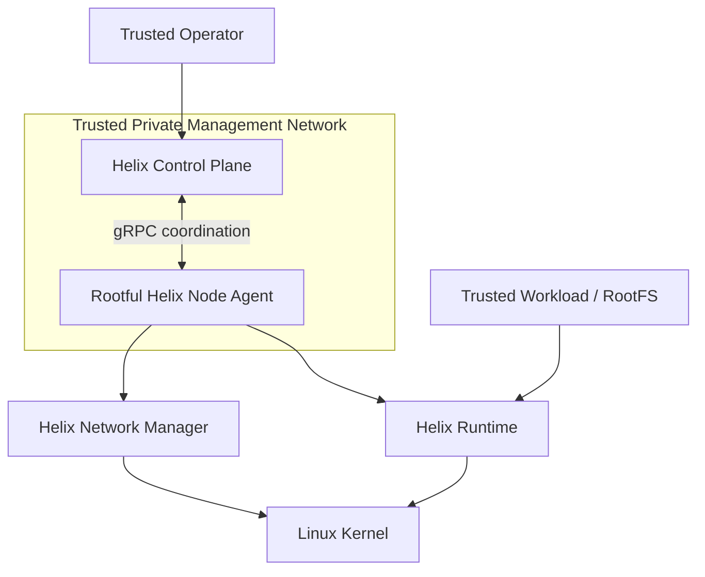

# Helixctl Security

> Current trust model, known risks, privilege boundaries, and future hardening work.

---

## 1. Security Status

Helixctl is a systems-learning project and is **not a production-grade secure container platform**.

The first complete version intentionally prioritizes understanding:

- namespaces
- cgroups
- process isolation
- networking
- scheduling
- failure recovery

over implementing every hardening feature used by mature runtimes.

Do not run untrusted workloads in the first version.

---

# 2. Trust Model

Initial assumptions:



Note:
- this is a trust model, not a production security boundary
- Agent/Runtime are rootful in v1
- containers share the host kernel
- untrusted workloads are unsupported
- public Agent exposure is unsupported

The project does not initially assume hostile tenants.

---

# 3. Rootful Runtime

The first Runtime is rootful.

It needs privileges for operations such as:

- namespace creation
- mounts
- `pivot_root`
- cgroup configuration
- veth creation
- bridge configuration
- route programming

This means a bug in the Agent/Runtime can have host-level impact.

Use disposable VMs.

---

# 4. Why Rootful First

Rootless containers require additional work:

```text
USER namespaces
UID/GID maps
capability handling
filesystem constraints
network restrictions
```

These are valuable topics, but they are not required to understand the first container runtime path.

Rootless execution is a later milestone.

---

# 5. Namespace Isolation Is Not Complete Security

Namespaces isolate views of kernel resources.

They do not magically make hostile code safe.

Containers still share the host kernel.

A kernel vulnerability or dangerous privilege configuration can break the isolation boundary.

---

# 6. cgroups Are Resource Controls

cgroups help limit resource usage.

They are not an authentication or privilege boundary.

A memory limit does not prevent filesystem or syscall attacks.

---

# 7. RootFS Trust

The first project may use a known BusyBox rootfs.

Do not automatically run arbitrary downloaded root filesystems as root.

Future image support will need:

- provenance
- digest verification
- extraction safety
- path traversal protection

---

# 8. Command Injection

The Runtime should execute:

```text
command + argument array
```

rather than building a shell command string where possible.

Avoid patterns such as:

```go
exec.Command("sh", "-c", userControlledString)
```

unless shell behavior is explicitly requested and the trust implications are understood.

---

# 9. Path Validation

Rootfs and runtime paths should be validated.

Avoid letting a container ID or user input create paths such as:

```text
../../host/path
```

Container IDs used in filesystem names should have a restricted format.

---

# 10. Mount Safety

Mount operations are privileged and dangerous.

The Runtime should:

- use expected paths
- avoid unintended host bind mounts
- make mount propagation behavior explicit
- clean up mounts after failure

---

# 11. `pivot_root` Safety

Incorrect root pivot/mount behavior can leave unexpected host paths visible.

Testing should verify the new root and old-root unmount behavior.

---

# 12. Device Exposure

Do not expose arbitrary host devices into containers in the first version.

Device handling is a separate security problem.

---

# 13. Linux Capabilities

A future hardening step is to drop unnecessary capabilities inside the container.

The first version may run with broader privilege while the Runtime is being learned, but it should not be described as hardened.

---

# 14. seccomp

Future work can restrict allowed syscalls using seccomp.

This is deliberately deferred until basic runtime correctness works.

A bad seccomp policy can make debugging much harder while the base Runtime is still changing.

---

# 15. AppArmor / SELinux

Mandatory access control can add another isolation layer.

Support is future work and platform-dependent.

---

# 16. Management Network

The first version assumes the Control Plane and Agents communicate on a trusted private network.

Do not expose an unauthenticated Agent gRPC listener to the public internet.

---

# 17. gRPC Authentication

Future production-style design should use:

```text
mTLS
```

between Control Plane and Agents.

This would provide:

- node identity
- encryption
- server authentication
- client authentication

Certificate lifecycle is not required initially.

---

# 18. External API Authentication

The first lab API may be unauthenticated on localhost/private network.

Future work should add:

- authentication
- authorization
- role separation
- audit logs

---

# 19. Route Programming Risk

The Agent can modify host routes.

A bad route update can break node connectivity.

Mitigations for development:

- dedicated VM
- only manage routes inside reserved Helix CIDRs
- tag/track Helix-managed routes where possible
- reconcile only project-owned routes
- avoid deleting arbitrary host routes

---

# 20. Bridge / Interface Risk

The Network Manager should only manipulate:

```text
helix0
Helix-generated veth names
Helix container namespaces
```

It should not remove interfaces it does not own.

Ownership rules matter during cleanup.

---

# 21. IPAM Conflicts

Container CIDRs must not overlap:

- management network
- host routes
- VPN routes
- other node container CIDRs

The Agent/Control Plane should validate obvious conflicts where practical.

---

# 22. DNS Trust

Internal DNS is part of service routing.

A compromised registry/DNS component could redirect service traffic.

The first trusted-cluster model accepts this.

Future hardened designs need authenticated control updates and stronger service identity.

---

# 23. Node Identity

The first Node ID can be configured explicitly.

Future design should avoid trusting arbitrary self-declared node identity over an untrusted network.

mTLS certificates can bind a node identity to credentials.

---

# 24. Heartbeat Spoofing

Without authentication, a malicious client could potentially impersonate a node.

This is another reason the first version must remain in a trusted lab network.

---

# 25. Denial of Service

Potential DoS vectors include:

- excessive workload requests
- exhausting container IP pool
- exhausting PIDs
- memory/CPU pressure
- DNS query flood
- repeated route churn

The first version can document these without implementing full rate limiting.

---

# 26. Resource Limits

cgroups should enforce per-container limits.

The Control Plane should also avoid overscheduling beyond known node capacity.

Neither mechanism alone is sufficient under hostile conditions, but both are useful safety controls.

---

# 27. Logging Sensitive Data

Do not log:

- secrets
- tokens
- private environment variables
- full credentials

Structured logs should contain operational identifiers, not arbitrary workload secrets.

---

# 28. Error Responses

External API errors should not expose:

- stack traces
- host filesystem paths unnecessarily
- sensitive environment data

Detailed low-level errors belong in trusted server logs.

---

# 29. Network Policy

The first network is broadly reachable inside the cluster.

Future network policy could express rules such as:

```text
frontend -> backend allowed
frontend -> database denied
```

Possible implementation paths include nftables/iptables or later eBPF work.

---

# 30. Encryption

The initial routed container network is not automatically encrypted.

If node-to-node traffic crosses an untrusted network, that is not acceptable for sensitive workloads.

Future encrypted overlay/tunnel options can be explored.

---

# 31. Persistent Volumes

Persistent workload volumes are not part of the first version.

If added later, filesystem permissions, mount isolation, multi-node access, and secret data become additional security concerns.

---

# 32. Threat Model: In Scope Initially

Initial security correctness focuses on avoiding accidental host damage from project bugs:

- path validation
- owned-resource cleanup
- route ownership
- resource limits
- explicit privileges
- trusted input assumptions

---

# 33. Threat Model: Out of Scope Initially

The first version does not claim resistance against:

- malicious container escape attempts
- hostile multi-tenant workloads
- compromised worker nodes
- hostile Control Plane
- public-network Agent attacks
- sophisticated kernel exploitation

---

# 34. Security Development Rules

- use disposable VMs
- take snapshots
- keep management network private
- do not run arbitrary untrusted rootfs images
- validate project-owned paths
- avoid broad host route deletion
- keep privileged code small and reviewable
- test cleanup paths

---

# 35. Future Hardening Roadmap

Possible order:

```text
USER namespace
    ↓
capability dropping
    ↓
seccomp
    ↓
mTLS
    ↓
external API auth
    ↓
network policy
    ↓
rootless mode
```

This should happen after core Runtime and networking behavior is stable.

---

# 36. Reporting Security Issues

For a public repository, security-sensitive issues should not include exploit details in a public issue before a responsible disclosure process is defined.

A dedicated security contact/process can be added when the project reaches that stage.

---

# 37. Security Definition of Done for v1

- [ ] README clearly says the Runtime is rootful.
- [ ] Project is documented as lab/non-production security.
- [ ] Runtime validates container IDs/paths.
- [ ] Cleanup only removes Helix-owned resources.
- [ ] Route manager only reconciles Helix-managed routes.
- [ ] Resource limits work.
- [ ] Agent is not exposed publicly in the documented lab setup.
- [ ] Untrusted workloads are explicitly unsupported.
- [ ] Security limitations are documented instead of implied away.
