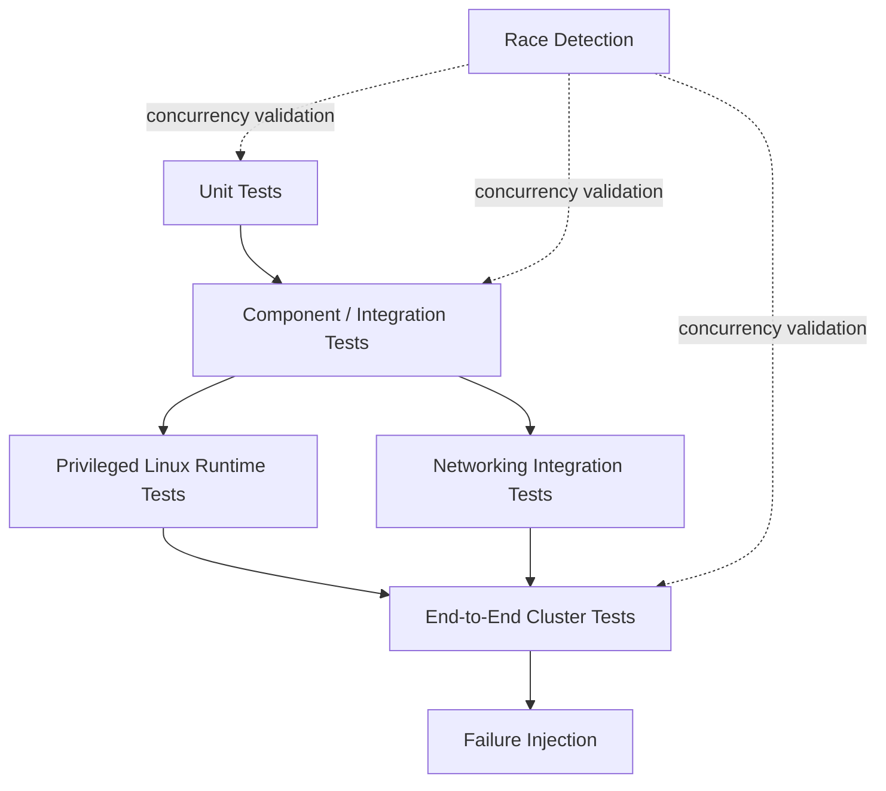

# Helixctl Testing Strategy

> Test plan for a concurrency-heavy Linux systems project spanning the Control Plane, Agent, Runtime, networking, service discovery, and failure recovery.

---

## 1. Testing Philosophy

Helixctl needs more than unit tests.

A scheduler can pass every unit test while the real system still fails because:

- namespace permissions are wrong
- cgroups are mounted differently
- veth cleanup leaks interfaces
- routes do not have a return path
- heartbeats race with reconciliation
- a process dies between inspection and action

The test strategy therefore uses multiple layers:



---

# 2. Test Layout

```text
internal/.../*_test.go

tests/
├── integration/
└── e2e/

scripts/
└── smoke-test.sh
```

Package unit tests stay beside the package.

Cross-component tests belong under `tests/`.

---

# 3. Unit Tests

Unit tests should cover deterministic logic without requiring privileged Linux operations.

Strong unit-test targets:

- scheduler filtering
- least-load scoring
- state transitions
- reconciliation decision logic
- IPAM allocation
- service endpoint filtering
- route desired-state calculation
- API validation
- cgroup value conversion
- configuration validation

---

# 4. Table-Driven Tests

Use idiomatic Go table-driven tests for rules with multiple cases.

Example scheduler cases:

```text
healthy + enough capacity -> eligible
unhealthy -> filtered
not network ready -> filtered
low CPU -> filtered
low memory -> filtered
```

This makes policy behavior easy to review.

---

# 5. Race Detector

Run:

```bash
go test -race ./...
```

especially against:

```text
controlplane/state
heartbeat processing
scheduler reads
reconciler writes
service endpoints
IPAM
route reconciliation
```

Passing normal tests is not enough for these packages.

---

# 6. Control Plane Unit Tests

Test:

- Node Registry updates
- heartbeat timestamps
- health transitions
- no-eligible-node scheduler result
- least-load node selection
- desired/actual mismatch handling
- route calculation
- endpoint health filtering

Inject a clock where timing logic is involved.

---

# 7. Runtime Unit Tests

Test logic that does not require real kernel isolation:

- spec validation
- lifecycle transitions
- cleanup planning
- cgroup quota formatting
- path validation
- signal decision logic

Kernel behavior belongs in Linux integration tests.

---

# 8. IPAM Tests

Test:

```text
first allocation
multiple allocations
release
reallocate released address
duplicate protection
pool exhaustion
reserved addresses
concurrent allocation
```

Concurrent allocation should be race-tested.

---

# 9. Service Discovery Tests

Test:

- service creation
- endpoint add/remove
- multiple replicas
- unhealthy endpoint filtering
- rescheduled endpoint replacement
- DNS answer generation
- unknown service response

---

# 10. Integration Tests

Integration tests connect real project components.

Examples:

```text
Control Plane <-> Agent gRPC
Agent <-> Runtime
Agent <-> Network Manager
Route Controller <-> Agent
Service Registry <-> DNS
```

Mocks should be used only where the boundary under test requires them.

---

# 11. gRPC Integration Tests

Start an Agent gRPC server and exercise:

```text
RegisterNode
Heartbeat
RunContainer
InspectContainer
StopContainer
ApplyRoutes
```

Verify:

- deadlines
- status codes
- conversion between domain/proto
- idempotent container ID behavior

---

# 12. Runtime Integration Environment

Runtime tests must run on Linux.

Recommended:

```text
Ubuntu Server 22.04+
cgroups v2
root or required capabilities
```

Do not pretend runtime syscall tests are platform-independent.

CI can separate ordinary Go tests from privileged Linux tests.

---

# 13. Namespace Tests

Verify:

### UTS

Container hostname differs from host.

### PID

Container process view is isolated.

### Mount

Container mount operations do not modify host mount table.

### Network

Container has a separate interface/route view.

---

# 14. cgroup Tests

Memory test:

- set low memory limit
- verify `memory.max`
- run controlled allocation workload
- observe expected enforcement

CPU test:

- configure `cpu.max`
- verify kernel value
- compare controlled workload behavior where practical

Avoid flaky timing assertions where exact performance is not guaranteed.

---

# 15. RootFS Tests

Verify:

- expected rootfs becomes `/`
- host root is not exposed through normal paths
- `/proc` is mounted correctly
- working directory exists
- cleanup unmounts temporary mounts

---

# 16. Signal Tests

Run a test process that records `SIGTERM`.

Verify:

```text
StopContainer
    ↓
SIGTERM received
    ↓
graceful exit
```

Then test a process that ignores `SIGTERM`.

Verify forced `SIGKILL` after timeout.

---

# 17. Same-Node Network Test

Node:

```text
container-a 10.10.1.2
container-b 10.10.1.3
```

Verify bidirectional connectivity.

This validates:

```text
netns
veth
bridge
IPAM
```

---

# 18. Cross-Node Network Test

Node A:

```text
10.10.1.0/24
```

Node B:

```text
10.10.2.0/24
```

Verify:

```text
A/container -> B/container
B/container -> A/container
```

This validates:

```text
route distribution
IP forwarding
underlay connectivity
return path
```

---

# 19. Route Join Test

Start A and B.

Add C.

Verify all required CIDR routes appear without manual route commands.

Then inspect:

```bash
ip route
```

on each node.

---

# 20. Route Removal Test

Remove Node C from the cluster.

Verify Helix-managed routes for C disappear after the selected health/removal policy.

---

# 21. DNS Test

Create service:

```text
auth
```

with two healthy endpoints.

Query:

```text
auth.service.cluster
```

Verify both healthy addresses can be returned.

Mark one unhealthy.

Verify it is no longer returned.

---

# 22. End-to-End Test Environment

Recommended full E2E cluster:

```text
1 Control Plane VM
3 Worker VMs
```

All nodes share a management/private network.

Each worker owns a distinct container CIDR.

---

# 23. E2E Happy Path

```text
start helixd
    ↓
start three Agents
    ↓
agents register
    ↓
helixctl node list
    ↓
submit workload
    ↓
scheduler selects node
    ↓
Runtime creates container
    ↓
network setup succeeds
    ↓
service endpoint becomes healthy
    ↓
DNS resolves service
```

---

# 24. E2E Node Failure

Initial:

```text
auth on Node B
```

Then:

```text
stop Node B or Agent/network access
```

Verify:

```text
heartbeats stop
node becomes SUSPECT
node becomes UNREACHABLE
endpoint removed
workload rescheduled
new IP allocated
new endpoint becomes healthy
DNS changes
```

---

# 25. Network Partition Test

Simulate Control Plane <-> Node B connectivity loss while Node B continues running.

Observe and document duplicate-workload risk if rescheduling occurs.

This test proves the current failure-model limitation rather than hiding it.

---

# 26. Control Plane Restart Test

Because state is in memory:

1. run workloads
2. restart `helixd`
3. keep Agents/containers running
4. Agents reconnect
5. actual state is rebuilt

Verify that historical desired intent is not falsely claimed to have survived.

---

# 27. Agent Restart Test

Restart `helix-agent` while workload processes remain where possible.

Verify the Agent can:

- reconnect
- inspect local reality
- report actual container state
- avoid blindly duplicating existing container IDs

---

# 28. Partial Failure Tests

Inject failures at different create stages:

```text
after IP allocation
after veth creation
after cgroup creation
after child process creation
during rootfs setup
```

Verify rollback leaves no obvious leaked resources.

---

# 29. Cleanup Tests

After repeated create/remove cycles verify:

```bash
ip netns list
ip link
ls /sys/fs/cgroup/helix
```

Expected:

- no leaked container namespaces
- no leaked veth interfaces
- no stale cgroups
- IP returned to pool
- service endpoint removed

---

# 30. Failure Injection

Useful injection mechanisms:

- stop Agent process
- disconnect VM network
- kill container process
- deny route operation
- make cgroup path read-only in a disposable VM
- force invalid rootfs
- exhaust IP pool

All destructive tests should run only in disposable environments.

---

# 31. Load Tests

The core project is not primarily an HTTP throughput benchmark, but useful load scenarios include:

- many concurrent container create requests
- heartbeat fan-in
- concurrent IP allocations
- repeated DNS queries
- repeated state reads during reconciliation

Metrics should be observed while `go test -race` remains part of concurrency validation.

---

# 32. Benchmark Tests

Useful Go benchmarks:

```text
scheduler selection
IPAM allocation
service lookup
state read/write
route calculation
```

Benchmarks should be used to find regressions, not to invent unrealistic performance claims.

---

# 33. Logging Assertions

Tests should not normally depend on exact log strings.

But critical operations should include enough structured context to debug a failed test:

```text
node_id
container_id
operation
error
```

---

# 34. Test Naming

Prefer names that explain behavior:

```text
TestLeastLoadSchedulerFiltersInsufficientMemory
TestIPAMReusesReleasedAddress
TestReconcilerReschedulesUnknownRunningWorkload
```

instead of generic names such as:

```text
TestScheduler2
```

---

# 35. CI Split

A future CI pipeline can separate:

```text
Job 1:
go test ./...

Job 2:
go test -race ./...

Job 3:
privileged Linux integration tests

Job 4:
multi-VM / E2E environment
```

Full E2E may remain manual or scheduled until reliable automation exists.

---

# 36. Test Artifacts

For failing E2E tests, collect:

```text
helixd logs
Agent logs
ip addr
ip route
bridge link
lsns
cgroup tree
service registry state
DNS query output
```

This makes distributed failures diagnosable.

---

# 37. Smoke Test Script

`scripts/smoke-test.sh` can validate a minimal cluster.

Possible steps:

```text
check helixd reachable
check at least one healthy node
run BusyBox workload
inspect workload
verify RUNNING
stop workload
verify STOPPED/removed
```

---

# 38. Test Safety

Runtime/network tests can modify:

```text
namespaces
mounts
cgroups
interfaces
routes
```

Use:

- disposable VMs
- snapshots
- isolated private networks

Do not run destructive tests on a production workstation without understanding the effect.

---

# 39. Acceptance Matrix

| Capability | Unit | Integration | E2E |
|---|---:|---:|---:|
| Scheduler | Yes | Yes | Yes |
| Heartbeats | Yes | Yes | Yes |
| Namespace isolation | Limited | Yes | Yes |
| cgroups | Limited | Yes | Yes |
| Same-node networking | Limited | Yes | Yes |
| Cross-node routing | Yes | Yes | Yes |
| Service discovery | Yes | Yes | Yes |
| Node failure rescheduling | Yes | Yes | Yes |
| Control Plane restart reconstruction | Yes | Yes | Yes |

---

# 40. Definition of Done

Testing is not complete until:

- [ ] core packages have unit tests
- [ ] concurrency-sensitive packages pass `go test -race`
- [ ] runtime integration tests run on Linux
- [ ] namespace isolation is verified
- [ ] cgroup enforcement is verified
- [ ] same-node networking works
- [ ] cross-node networking works
- [ ] route join/remove works
- [ ] DNS filters unhealthy endpoints
- [ ] node failure causes replacement scheduling
- [ ] cleanup tests show no obvious resource leaks
- [ ] Control Plane restart behavior matches the documented in-memory limitation
- [ ] E2E logs are sufficient to debug failures
