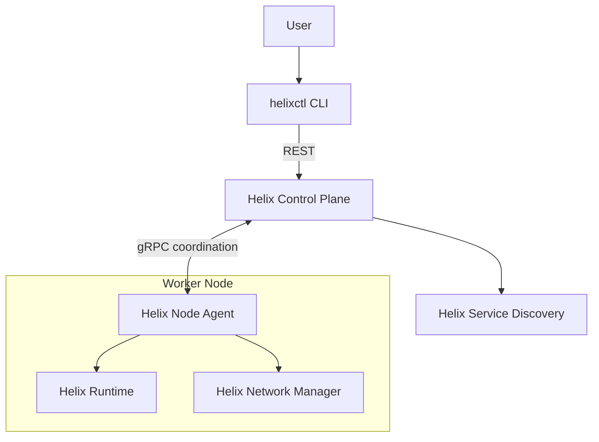

# Helixctl

Helixctl is a Go-based container platform built from Linux primitives to explore how container runtimes, schedulers, multi-node networking, service discovery, and reconciliation work underneath platforms such as Docker and Kubernetes.

The project intentionally implements important Linux mechanics directly instead of delegating container creation to Docker/containerd/runc or orchestration to Kubernetes.

## Why Helixctl Exists

Helixctl is a systems-learning project that bridges the gap between high-level orchestration concepts and low-level Linux kernel mechanics. By building these components from first principles, it reveals the engineering trade-offs required to manage workloads, networking, and state in a distributed system.

## What It Builds

- Linux container runtime (isolation, cgroups v2, pivot_root)
- Multi-node orchestrator (scheduling, state, health, reconciliation)
- Container networking (veth pairs, bridge, L3 routing)
- Service discovery and internal DNS

## Architecture Overview

## Core Components

### helixctl
User-facing CLI. Only talks to the Control Plane REST API.

### helixd
Control Plane daemon. Owns desired state, node registry, scheduler, health manager, reconciler, route controller, and service discovery coordination.

### helix-agent
Runs on worker nodes. Owns local orchestration/coordination: registration, heartbeats, Runtime calls, Network Manager calls, reporting actual state, and applying route updates.

### Helix Runtime
Owns namespace isolation, cgroups v2, rootfs, pivot_root, process lifecycle, PID tracking, and cleanup.

### Helix Network Manager
Owns veth pairs, bridge attachment, IP allocation, interface setup, local route programming, and Helix-owned network cleanup.

### Helix Service Discovery
Owns service registry, endpoint store, health-aware endpoint filtering, and internal DNS.

## Workload / Container / Service Model

- **Workload**: logical desired execution requested by the user / Control Plane.
- **Container Instance**: one concrete Linux process execution of a workload on a particular node.
- **Service**: stable logical network identity backed by one or more healthy container instances.
- **Node**: a Linux worker machine/VM participating in the cluster.

## End-to-End Workload Flow

1. `helixctl container run` sends REST request to `helixd`.
2. `helixd` stores desired workload state.
3. Scheduler selects a healthy node.
4. `helixd` contacts the Node Agent via gRPC.
5. Agent coordinates Runtime + Network Manager to prepare namespaces, cgroups, rootfs, veth, `helix0`, and IP.
6. Workload process starts.
7. Actual state is reported to the Control Plane.
8. Healthy service endpoint becomes discoverable.

## Networking Model

Each container gets a network namespace. A veth pair connects the container to the host, and the host side attaches to `helix0`. Every node owns a unique container CIDR. Same-node traffic uses the Linux bridge; cross-node traffic uses regular Linux L3 routes. Control Plane Route Controller calculates desired routes, and Node Agents apply Helix-owned routes.

See [docs/NETWORKING.md](docs/NETWORKING.md) for details.

## API Model

The external API is REST, utilized by `helixctl`. Internal node coordination uses gRPC for typed Control Plane ↔ Node Agent communication.

## Repository Structure

    helixctl/
    ├── cmd/
    │   ├── helixctl/
    │   ├── helixd/
    │   └── helix-agent/
    ├── api/
    │   ├── proto/
    │   │   └── helix/v1/
    │   └── openapi/
    ├── gen/
    │   └── proto/
    ├── internal/
    │   ├── controlplane/
    │   ├── agent/
    │   ├── runtime/
    │   ├── network/
    │   ├── discovery/
    │   ├── agentclient/
    │   ├── domain/
    │   ├── config/
    │   └── observability/
    ├── tests/
    │   ├── integration/
    │   └── e2e/
    ├── scripts/
    ├── docs/
    ├── Makefile
    ├── go.mod
    └── README.md

## Quick Start / Development Environment

Helixctl requires Linux with cgroups v2, `iproute2`, and `util-linux`. We recommend using disposable Linux VMs (e.g., Ubuntu 22.04+). See [docs/DEVELOPMENT.md](docs/DEVELOPMENT.md).

## Example CLI Usage

    helixctl container run \
      --name web \
      --rootfs /opt/helix/rootfs/busybox \
      --cpu 500m \
      --memory 128m \
      -- /bin/sh -c "sleep 3600"

## Testing

See [docs/TESTING.md](docs/TESTING.md).

## Current v1 Limitations

- Control Plane state is intentionally in-memory.
- Restarting `helixd` loses historical desired-state memory.
- Worker containers may continue running.
- Agents can reconnect and report actual running workloads.
- Node failure recovery is workload recreation, not live migration.
- Network-partition risk: duplicate instances may temporarily exist.

## Security Model

Helixctl v1 is a rootful systems-learning platform intended for trusted lab environments. It is not a production-grade secure container runtime and should not be used to run untrusted workloads. Runtime and networking require elevated Linux privileges.

See [docs/SECURITY.md](docs/SECURITY.md).

## Implementation Roadmap

See [docs/ROADMAP.md](docs/ROADMAP.md).

## Documentation

| Document | Purpose |
|---|---|
| [docs/ARCHITECTURE.md](docs/ARCHITECTURE.md) | Architecture and component boundaries |
| [docs/RUNTIME.md](docs/RUNTIME.md) | Linux container runtime internals |
| [docs/NETWORKING.md](docs/NETWORKING.md) | netns, veth, bridge, IPAM, routing |
| [docs/CONTROL_PLANE.md](docs/CONTROL_PLANE.md) | scheduling, state, health, reconciliation |
| [docs/API.md](docs/API.md) | REST and gRPC contracts |
| [docs/TESTING.md](docs/TESTING.md) | Test strategy |
| [docs/DEVELOPMENT.md](docs/DEVELOPMENT.md) | Development workflow |
| [docs/SECURITY.md](docs/SECURITY.md) | Trust model and hardening roadmap |
| [docs/ROADMAP.md](docs/ROADMAP.md) | Milestones |
| [docs/adr/](docs/adr/) | Architectural Decision Records |
| [CONTRIBUTING.md](CONTRIBUTING.md) | Contribution rules |

## Project Status

Experimental systems-learning project.
