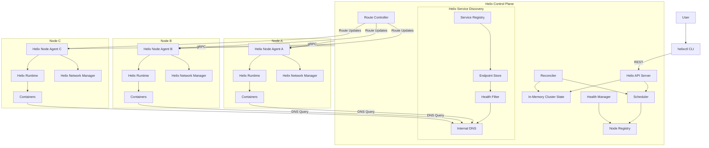
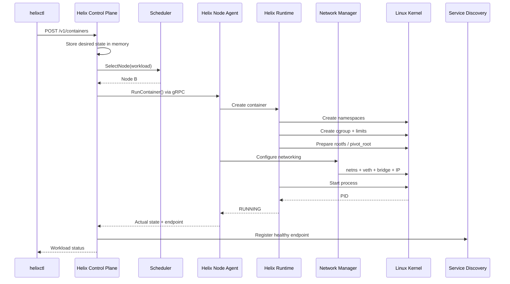
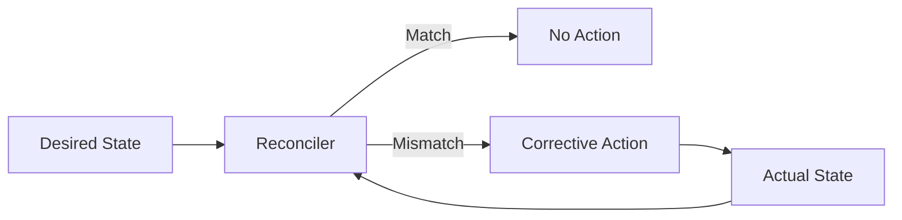

# Helixctl

> A Go-based container platform built from Linux primitives to explore how container runtimes, schedulers, networking, service discovery, and reconciliation work beneath tools such as Docker and Kubernetes.

Helixctl is an advanced systems project that combines a **custom Linux container runtime**, a **multi-node orchestrator**, and **container networking** into one integrated platform.

The project is intentionally built close to the operating system. Instead of delegating container creation to Docker or orchestration to Kubernetes, Helixctl implements the important mechanics directly using Linux namespaces, cgroups v2, `pivot_root`, virtual Ethernet pairs, Linux bridges, routing, node agents, scheduling, health monitoring, and service discovery.

The purpose is not to replace production container platforms. The purpose is to understand the systems engineering behind them by building a smaller platform from first principles.

---

## Table of Contents

- [Project Goals](#project-goals)
- [What Helixctl Builds](#what-helixctl-builds)
- [High-Level Architecture](#high-level-architecture)
- [Core Components](#core-components)
- [How a Workload Runs](#how-a-workload-runs)
- [Node, Container, and Service Model](#node-container-and-service-model)
- [Project Structure](#project-structure)
- [Why the Repository Is Structured This Way](#why-the-repository-is-structured-this-way)
- [Package Dependency Rules](#package-dependency-rules)
- [Control Plane State](#control-plane-state)
- [Container Runtime](#container-runtime)
- [Networking](#networking)
- [Scheduling](#scheduling)
- [Service Discovery](#service-discovery)
- [Failure Recovery](#failure-recovery)
- [CLI](#cli)
- [Development Environment](#development-environment)
- [Testing Strategy](#testing-strategy)
- [Implementation Roadmap](#implementation-roadmap)
- [Definition of Done](#definition-of-done)
- [Design Principles](#design-principles)

---


# Documentation Map

The repository documentation is split by subsystem so that the README stays readable while the low-level design remains explicit.

| Document | Purpose |
|---|---|
| [`docs/INDEX.md`](docs/INDEX.md) | Documentation index |
| [`docs/ARCHITECTURE.md`](docs/ARCHITECTURE.md) | Complete system architecture, component boundaries, lifecycle, and major design decisions |
| [`docs/NETWORKING.md`](docs/NETWORKING.md) | Network namespaces, veth, bridge, IPAM, multi-node routing, DNS, and packet debugging |
| [`docs/RUNTIME.md`](docs/RUNTIME.md) | Linux container runtime internals: namespaces, cgroups v2, rootfs, `pivot_root`, process lifecycle, cleanup |
| [`docs/CONTROL_PLANE.md`](docs/CONTROL_PLANE.md) | In-memory state, scheduling, node registry, heartbeats, reconciliation, routing coordination, failure handling |
| [`docs/API.md`](docs/API.md) | External REST API and internal gRPC contracts |
| [`docs/TESTING.md`](docs/TESTING.md) | Unit, integration, E2E, race, failure-injection, runtime, and networking test strategy |
| [`docs/DEVELOPMENT.md`](docs/DEVELOPMENT.md) | Linux/VM setup, build workflow, cluster startup, debugging, and development conventions |
| [`docs/SECURITY.md`](docs/SECURITY.md) | Current trust model, rootful runtime risks, privilege boundaries, and future hardening |
| [`docs/ROADMAP.md`](docs/ROADMAP.md) | Implementation sequence from project skeleton to a complete multi-node system |
| [`docs/adr/`](docs/adr/) | Architecture Decision Records for the decisions that should remain easy to review independently |
| [`CONTRIBUTING.md`](CONTRIBUTING.md) | Contribution workflow, coding rules, testing expectations, and pull-request checklist |

---

# Project Goals

Helixctl is designed to answer practical systems questions such as:

- What is a container at the Linux process level?
- How are processes isolated using namespaces?
- How are CPU and memory limits enforced with cgroups?
- How does a container receive its own filesystem and network stack?
- How does an orchestrator decide which node should run a workload?
- How does a worker node receive and execute cluster instructions?
- How does the control plane detect node failure?
- How can workloads be recreated when a node disappears?
- How do containers communicate across different Linux hosts?
- How does service discovery remain stable when container IPs change?
- How does desired-state reconciliation make an orchestrator self-correcting?

The project deliberately keeps these mechanisms visible rather than hiding them behind existing container platforms.

---

# What Helixctl Builds

The complete system consists of six major pieces:

```text
Helixctl
├── helixctl CLI
├── Helix Control Plane
├── Helix Node Agent
├── Helix Runtime
├── Helix Network Manager
└── Helix Service Discovery
```

The system supports:

- Linux container creation
- PID, UTS, Mount, and Network namespaces
- cgroups v2 resource control
- isolated root filesystems
- `pivot_root`
- multi-node workload scheduling
- resource-aware placement
- worker node registration
- heartbeats and node health
- desired vs actual state
- reconciliation
- container IP allocation
- veth pairs
- Linux bridges
- automatic multi-node route programming
- service registration
- internal DNS
- health-aware service endpoints
- workload recreation after node failure

---

# High-Level Architecture



The complete architecture and design rationale are documented in [`docs/ARCHITECTURE.md`](docs/ARCHITECTURE.md).

---

# Core Components

## `helixctl`

The user-facing command-line client.

It is intentionally lightweight.

Its responsibilities are limited to:

- parsing CLI commands,
- creating REST requests,
- calling the Helix Control Plane,
- formatting responses.

It does **not** contain:

- scheduling logic,
- container runtime logic,
- networking logic,
- direct worker-node communication.

Example:

```bash
helixctl node list
helixctl container list
helixctl container inspect <container-id>
helixctl service list
```

---

## `helixd`

The Helix Control Plane daemon.

It owns cluster-level intent and decision-making.

Responsibilities include:

- REST API
- Node Registry
- Scheduler
- Health Manager
- Reconciler
- Route Controller
- Service Discovery
- in-memory cluster state

The Control Plane answers:

> What should be running, and where should it run?

---

## `helix-agent`

A long-running daemon on every worker node.

Responsibilities include:

- registering the node,
- sending heartbeats,
- reporting CPU and memory capacity,
- receiving lifecycle commands over gRPC,
- invoking the local runtime,
- invoking the local network manager,
- reporting container state,
- applying route updates.

The Node Agent answers:

> What does this node need to execute locally?

---

## Helix Runtime

The execution engine responsible for Linux container isolation.

It handles:

- namespaces,
- cgroups v2,
- root filesystem isolation,
- process creation,
- process lifecycle,
- local runtime state.

---

## Helix Network Manager

Responsible for container connectivity.

It handles:

- network namespaces,
- veth pairs,
- Linux bridges,
- container IP allocation,
- route programming,
- network cleanup.

---

## Helix Service Discovery

Provides stable service identities even when containers move between nodes.

It contains:

```text
Service Registry
Endpoint Store
Health Filter
Internal DNS
```

Example stable name:

```text
auth.service.cluster
```

A service name remains stable even when:

- a container crashes,
- a node fails,
- a workload is rescheduled,
- a container receives a different IP.

---

# How a Workload Runs

A workload request flows through the system like this:



---

# Node, Container, and Service Model

These are three different concepts.

## Node

A Linux machine or VM participating in the Helix cluster.

```text
node-a
node-b
node-c
```

A node hosts containers.

---

## Container

A concrete isolated Linux process.

```text
auth-7f82
```

A container:

- runs on one node,
- has a host PID,
- receives a container IP,
- has resource limits,
- can fail,
- can be recreated.

---

## Service

A stable logical identity backed by one or more containers.

```text
auth
payments
orders
```

Example:

```text
Cluster

Node A
├── auth-1
└── payments-1

Node B
├── auth-2
└── orders-1

Node C
└── payments-2
```

Logical services:

```text
auth
├── auth-1
└── auth-2

payments
├── payments-1
└── payments-2

orders
└── orders-1
```

The relationship is:

```text
Node
  ↓ hosts
Container
  ↓ may back
Service
```

The node may change.

The container may change.

The IP may change.

The service name stays stable.

---

# Project Structure

The repository is organized around **runtime boundaries**, not around generic utility folders.

```text
helixctl/
│
├── cmd/
│   ├── helixctl/
│   │   └── main.go
│   │
│   ├── helixd/
│   │   └── main.go
│   │
│   └── helix-agent/
│       └── main.go
│
├── api/
│   ├── proto/
│   │   └── helix/
│   │       └── v1/
│   │           └── agent.proto
│   │
│   └── openapi/
│       └── helix.yaml
│
├── gen/
│   └── proto/
│       └── helix/
│           └── v1/
│
├── internal/
│   │
│   ├── controlplane/
│   │   ├── server/
│   │   ├── scheduler/
│   │   ├── registry/
│   │   ├── reconciler/
│   │   ├── health/
│   │   ├── routes/
│   │   └── state/
│   │
│   ├── agent/
│   │   ├── server/
│   │   ├── registration/
│   │   ├── heartbeat/
│   │   ├── lifecycle/
│   │   └── reporter/
│   │
│   ├── runtime/
│   │   ├── container/
│   │   ├── namespace/
│   │   ├── cgroup/
│   │   ├── rootfs/
│   │   └── process/
│   │
│   ├── network/
│   │   ├── netns/
│   │   ├── veth/
│   │   ├── bridge/
│   │   ├── ipam/
│   │   └── routing/
│   │
│   ├── discovery/
│   │   ├── registry/
│   │   ├── endpoints/
│   │   ├── health/
│   │   └── dns/
│   │
│   ├── agentclient/
│   │
│   ├── domain/
│   │   ├── container.go
│   │   ├── node.go
│   │   ├── service.go
│   │   └── endpoint.go
│   │
│   ├── config/
│   │
│   └── observability/
│
├── tests/
│   ├── integration/
│   └── e2e/
│
├── scripts/
│   ├── setup-node.sh
│   ├── setup-cluster.sh
│   └── smoke-test.sh
│
├── docs/
│   ├── ARCHITECTURE.md
│   ├── NETWORKING.md
│   ├── RUNTIME.md
│   ├── CONTROL_PLANE.md
│   ├── API.md
│   ├── TESTING.md
│   ├── DEVELOPMENT.md
│   ├── SECURITY.md
│   ├── ROADMAP.md
│   └── adr/
│       ├── 001-internal-grpc.md
│       ├── 002-in-memory-control-plane-state.md
│       ├── 003-routed-networking.md
│       └── 004-service-discovery.md
│
├── Makefile
├── go.mod
├── go.sum
└── README.md
```

---

# Why the Repository Is Structured This Way

## `cmd/`

```text
cmd/
├── helixctl/
├── helixd/
└── helix-agent/
```

Helixctl produces **three separate executables**.

### Why three binaries?

Because they have completely different responsibilities.

```text
helixctl
= user client

helixd
= cluster brain

helix-agent
= worker-node controller
```

Keeping them separate also reflects how the system is deployed:

```text
Admin / Developer Machine
└── helixctl

Control Plane Host
└── helixd

Worker Node A
└── helix-agent

Worker Node B
└── helix-agent
```

The `cmd/` packages should contain only startup and dependency wiring.

Business logic does not belong in `main.go`.

---

## `api/`

```text
api/
├── proto/
└── openapi/
```

This directory contains external contracts.

### `api/proto/`

Contains Protobuf definitions for Control Plane ↔ Agent communication.

Example:

```text
RegisterNode
Heartbeat
RunContainer
StopContainer
InspectContainer
ApplyRoutes
```

### `api/openapi/`

Contains the REST contract exposed by the Control Plane.

Keeping protocol definitions separate prevents transport details from leaking into domain logic.

---

## `gen/`

```text
gen/proto/
```

Generated Protobuf code lives here.

### Why separate generated code?

Generated files should not be mixed with handwritten source code.

The flow is:

```text
agent.proto
    ↓
protoc
    ↓
gen/proto/helix/v1/
```

This makes ownership clear:

```text
api/proto
= source contract

gen/proto
= generated implementation
```

---

## `internal/`

Most implementation code lives under Go's `internal` directory.

### Why `internal`?

Go prevents packages under `internal/` from being imported by unrelated external modules.

Helixctl is currently one application, not a public Go SDK.

Using `internal/`:

- protects package boundaries,
- discourages accidental public APIs,
- keeps implementation details private to the project.

A public `pkg/` directory can be added later if Helixctl exposes a reusable Go SDK.

---

## `internal/controlplane/`

```text
controlplane/
├── server/
├── scheduler/
├── registry/
├── reconciler/
├── health/
├── routes/
└── state/
```

Contains cluster-level decision logic.

### `server/`

REST handlers and Control Plane server wiring.

### `scheduler/`

Contains placement policies.

Examples:

```text
round-robin
least-load
resource filtering
```

### `registry/`

Tracks cluster nodes.

This is a **Node Registry**, not a service registry.

### `reconciler/`

Compares desired state and actual state and determines corrective actions.

### `health/`

Evaluates node health from heartbeat information.

### `routes/`

Maintains node CIDR ownership and calculates route updates.

### `state/`

Owns the concurrency-safe in-memory cluster state.

This package should be the only place that directly owns the main maps/indexes used by the Control Plane.

Example:

```go
type State struct {
    mu sync.RWMutex

    nodes     map[string]Node
    workloads map[string]Workload
    services  map[string]Service
    endpoints map[string][]Endpoint
    routes    map[string]Route
}
```

Centralizing state prevents random packages from mutating shared maps independently.

---

## `internal/agent/`

```text
agent/
├── server/
├── registration/
├── heartbeat/
├── lifecycle/
└── reporter/
```

Contains worker-node orchestration logic.

### Why separate Agent code from Runtime code?

The Agent understands the **cluster**.

The Runtime understands the **local Linux host**.

The Agent can know:

```text
Control Plane address
Node ID
gRPC
Heartbeat
Container assignment
```

The Runtime should not know any of those things.

This boundary is critical.

---

## `internal/runtime/`

```text
runtime/
├── container/
├── namespace/
├── cgroup/
├── rootfs/
└── process/
```

Contains the low-level container runtime.

### `container/`

Coordinates local container lifecycle.

### `namespace/`

Handles Linux namespace creation and entry.

### `cgroup/`

Creates cgroups v2 and enforces resource limits.

### `rootfs/`

Prepares the root filesystem and performs `pivot_root`.

### `process/`

Starts, monitors, signals, and cleans up Linux processes.

### Why is networking not inside `runtime/`?

Because networking becomes a substantial independent subsystem.

The runtime owns:

```text
isolation + process execution
```

The network package owns:

```text
connectivity
```

This prevents the runtime package from becoming a monolith.

---

## `internal/network/`

```text
network/
├── netns/
├── veth/
├── bridge/
├── ipam/
└── routing/
```

Contains all container-networking behavior.

### `netns/`

Network namespace operations.

### `veth/`

Virtual Ethernet pair creation and cleanup.

### `bridge/`

Linux bridge creation and interface attachment.

### `ipam/`

Allocates and releases container IP addresses.

### `routing/`

Programs node and container routes.

### Why separate these concerns?

Container networking has multiple independently testable layers:

```text
namespace
    ↓
interface
    ↓
bridge
    ↓
IP
    ↓
routing
```

Keeping each layer focused makes debugging much easier.

---

## `internal/discovery/`

```text
discovery/
├── registry/
├── endpoints/
├── health/
└── dns/
```

Contains service discovery.

### `registry/`

Maintains logical service definitions.

### `endpoints/`

Tracks containers backing each service.

### `health/`

Filters unhealthy endpoints.

### `dns/`

Provides stable internal DNS names.

Example:

```text
auth.service.cluster
```

### Why is service discovery separate from Node Registry?

Because they solve different problems.

Node Registry:

```text
Which machines exist?
```

Service Registry:

```text
Which healthy containers currently provide this application service?
```

Mixing them would couple infrastructure membership with application discovery.

---

## `internal/agentclient/`

Contains the Control Plane's client for worker agents.

It is responsible for translating domain operations into gRPC requests.

Example:

```text
Reconciler
    ↓
AgentClient.RunContainer()
    ↓
Protobuf
    ↓
gRPC
    ↓
Node Agent
```

### Why have this layer?

The scheduler and reconciler should not directly manipulate generated Protobuf types.

Instead of:

```go
reconciler.Run(*helixv1.RunContainerRequest)
```

the Control Plane should work with domain models.

This keeps transport concerns outside orchestration logic.

---

## `internal/domain/`

```text
domain/
├── container.go
├── node.go
├── service.go
└── endpoint.go
```

Contains the central domain model.

These types describe the system itself rather than any specific transport or storage implementation.

Examples:

```text
Node
Container
Service
Endpoint
ResourceRequirements
ContainerState
NodeState
```

### Important rule

A domain type should not depend on:

- REST
- Protobuf
- Linux netlink
- filesystem layout
- CLI parsing

Conceptually:

```text
REST DTO
   ↓
Domain Model
   ↑
gRPC conversion

Kernel state
   ↓
Domain Model
```

The domain package keeps the rest of the codebase speaking one consistent language.

---

## `internal/config/`

Contains configuration loading and validation.

Possible configuration includes:

```text
Control Plane address
Agent listen address
REST listen address
gRPC listen address
Node management interface
Bridge name
Container CIDR
Heartbeat interval
Health timeout
DNS listen address
Runtime root directory
```

Configuration should not be scattered across packages.

---

## `internal/observability/`

Contains shared logging and metrics configuration.

Examples:

```text
structured logging
Prometheus metrics
component labels
request duration
container startup latency
scheduler latency
```

Keeping observability centralized gives all components consistent telemetry.

---

## `tests/integration/`

Tests boundaries between real components.

Examples:

```text
Control Plane + Agent gRPC
Agent + Runtime
Runtime + Network Manager
Service Registry + DNS
Scheduler + Node Registry
```

Integration tests should validate actual component behavior rather than only mocks.

---

## `tests/e2e/`

Runs full cluster scenarios.

Example:

```text
Start Control Plane
    ↓
Start multiple Agents
    ↓
Submit workload
    ↓
Verify scheduling
    ↓
Verify container isolation
    ↓
Verify networking
    ↓
Kill worker node
    ↓
Verify failure detection
    ↓
Verify workload recreation
    ↓
Verify DNS endpoint changed
```

This is the strongest proof that Helixctl works as a system.

---

## `scripts/`

Contains environment and test automation.

Examples:

```text
setup-node.sh
setup-cluster.sh
smoke-test.sh
```

These scripts are operational helpers.

They should not contain core application logic.

---

## `docs/`

Contains engineering documentation.

```text
docs/
├── ARCHITECTURE.md
└── NETWORKING.md
```

### `ARCHITECTURE.md`

Explains:

- architecture,
- decisions,
- trade-offs,
- system flows,
- failure behavior,
- component boundaries.

### `NETWORKING.md`

Can document the complete packet path:

```text
container
→ veth
→ bridge
→ host routing
→ remote node
→ bridge
→ veth
→ container
```

Keeping deep technical documentation outside the README prevents the README from becoming the implementation specification.

---

# Package Dependency Rules

The codebase follows a strict dependency direction.

```text
Transport / CLI
      ↓
Application Components
      ↓
Domain Contracts
      ↑
Infrastructure Implementations
```

The runtime architecture should match the code architecture.

---

## Rule 1 — Control Plane Never Touches Linux Runtime Internals

Not allowed:

```text
Control Plane
    ↓
namespace.Create()
```

Correct:

```text
Control Plane
    ↓
AgentClient
    ↓
gRPC
    ↓
Node Agent
    ↓
Runtime
    ↓
Linux
```

---

## Rule 2 — Node Agent Does Not Schedule

The Agent executes assignments.

It does not decide which node should receive a workload.

```text
Scheduler
= Control Plane responsibility

Execution
= Agent responsibility
```

---

## Rule 3 — Runtime Does Not Know About the Cluster

The runtime should not know:

- other nodes,
- scheduler policies,
- Control Plane address,
- service replicas,
- node health.

The runtime receives a local container specification and executes it.

---

## Rule 4 — CLI Never Talks Directly to Worker Nodes

Correct:

```text
helixctl
    ↓
Control Plane
    ↓
Node Agent
```

Not:

```text
helixctl
    ↓
random worker node
```

The cluster must remain the abstraction exposed to users.

---

## Rule 5 — Domain Models Stay Transport Independent

The domain layer should not expose generated gRPC messages or REST request structs.

```text
HTTP DTO
   ↓
Domain Object
   ↓
Application Logic
   ↓
Domain Object
   ↓
Protobuf Conversion
```

---

# Control Plane State

Helixctl currently uses an **in-memory Control Plane state model**.

There is no SQL database in the first version.

Conceptually:

```text
Helix Control Plane
        |
        v
Concurrency-Safe In-Memory State
        |
        +-- Nodes
        +-- Workloads
        +-- Services
        +-- Endpoints
        +-- Routes
        +-- IP Allocations
```

The state package owns the internal maps and protects them using synchronization such as `sync.RWMutex`.

Multiple components may access cluster state concurrently:

```text
REST handlers
Scheduler
Heartbeat processing
Health Manager
Reconciler
Route Controller
Service Discovery
```

State access therefore must be synchronized.

---

## Restart Limitation

Because the first version intentionally uses in-memory state:

```text
helixd restart
    ↓
Control Plane memory is lost
```

Worker containers may continue running.

When Agents reconnect, Helixctl can rebuild much of the **actual state** from worker reports:

```text
Nodes
Running containers
Container IPs
Routes
Health
```

However, historical user intent that existed only in memory may be lost.

This is an explicit first-version trade-off.

---

# Container Runtime

A Helix container is:

```text
Linux Process
+ PID Namespace
+ UTS Namespace
+ Mount Namespace
+ Network Namespace
+ cgroups v2
+ Root Filesystem
+ Virtual Network Interface
```

The runtime creation path is:

```text
Prepare rootfs
    ↓
Create namespaces
    ↓
Create cgroup
    ↓
Apply CPU / memory limits
    ↓
Configure network
    ↓
pivot_root
    ↓
Start process
    ↓
Track PID
```

---

## Namespaces

Initial namespaces:

```text
PID
UTS
MNT
NET
```

Possible later additions:

```text
IPC
USER
```

---

## cgroups v2

cgroups control resource consumption.

Example:

```text
CPU    <= 500m
Memory <= 128 MiB
```

Conceptual path:

```text
/sys/fs/cgroup/helix/<container-id>/
```

Important files include:

```text
cpu.max
memory.max
cgroup.procs
```

---

## Root Filesystem

The first runtime uses a minimal BusyBox filesystem.

The final runtime path uses:

```text
pivot_root
```

rather than relying only on `chroot`.

---

# Networking

Helixctl builds container networking using Linux primitives.

```text
Network Namespace
+
veth Pair
+
Linux Bridge
+
IPAM
+
Host Routing
```

Local packet path:

```text
Container
   ↓
eth0
   ↓
veth peer
   ↓
host veth
   ↓
Linux bridge
   ↓
host network
```

---

## Node CIDRs

Each node owns a unique container CIDR.

Example:

```text
Node A -> 10.10.1.0/24
Node B -> 10.10.2.0/24
Node C -> 10.10.3.0/24
```

This makes route ownership explicit.

---

## Dynamic Route Programming

Routes are not manually hardcoded on every machine.

A node registers:

```text
Management IP
Container CIDR
```

Example:

```text
Node B
Management IP: 192.168.50.12
Container CIDR: 10.10.2.0/24
```

The Route Controller calculates:

```text
10.10.2.0/24 via 192.168.50.12
```

and pushes the route to the other Node Agents.

The Agent programs the Linux route table.

A Go netlink library can be used rather than invoking `ip route` commands.

---

# Scheduling

Scheduling uses two stages:

```text
Candidate Nodes
      ↓
   Filter
      ↓
Eligible Nodes
      ↓
   Score
      ↓
Selected Node
```

Filtering checks:

```text
healthy?
enough CPU?
enough memory?
```

The main placement strategy is:

```text
resource filtering
+
least-load scoring
```

A scheduler interface allows policies to change without rewriting the Control Plane.

Possible implementations:

```text
RoundRobinScheduler
LeastLoadScheduler
```

---

# Service Discovery

Services provide stable identities for changing container endpoints.

Example:

```text
auth.service.cluster
```

may resolve to:

```text
10.10.1.4
10.10.2.7
```

The discovery path is:

```text
Internal DNS
     ↓
Health Filter
     ↓
Endpoint Store
     ↓
Service Registry
```

Unhealthy containers should not be returned.

---

## Rescheduling Example

Before failure:

```text
auth
├── 10.10.1.4
└── 10.10.2.7
```

Node B fails.

The workload is recreated on Node C:

```text
10.10.3.5
```

Service discovery becomes:

```text
auth
├── 10.10.1.4
└── 10.10.3.5
```

The application continues using:

```text
auth.service.cluster
```

---

# Failure Recovery

Helixctl continuously compares:

```text
Desired State
vs
Actual State
```

The Reconciler repairs differences.



Example:

```text
Desired = RUNNING
Actual  = FAILED
```

Possible corrective action:

```text
restart workload
```

Node failure:

```text
Desired = RUNNING
Actual  = UNKNOWN
```

Possible corrective action:

```text
schedule replacement on another healthy node
```

This is workload recreation, not live process migration.

---

# CLI

The main executable used by users is:

```bash
helixctl
```

Planned command model:

```bash
helixctl node list
helixctl node inspect <node-id>

helixctl container run [options] -- <command>
helixctl container list
helixctl container inspect <container-id>
helixctl container stop <container-id>

helixctl service list
helixctl service inspect <service-name>
```

Example:

```bash
helixctl container run \
  --name web \
  --image busybox \
  --cpu 500m \
  --memory 128m \
  -- sh -c "sleep 3600"
```

---

# Development Environment

The runtime requires Linux-specific kernel functionality.

Recommended environment:

```text
Ubuntu Server 22.04+
```

Possible setup:

- Linux workstation
- Linux VM
- UTM
- VirtualBox
- cloud VM

A complete multi-node cluster should eventually use:

```text
1 Control Plane
+
2–3 Worker Nodes
```

The worker nodes need suitable privileges for:

- namespaces,
- mounts,
- cgroups,
- veth creation,
- Linux bridge operations,
- route programming.

---

# Testing Strategy

Testing is split into three levels.

## Unit Tests

Located next to package implementation.

Example:

```text
internal/controlplane/scheduler/
├── leastload.go
└── leastload_test.go
```

Good unit-test targets:

- scheduler scoring,
- node filtering,
- IP allocation,
- state transitions,
- service endpoint filtering,
- reconciliation decisions.

---

## Integration Tests

Located in:

```text
tests/integration/
```

Examples:

- Control Plane ↔ Node Agent gRPC
- Agent ↔ Runtime
- Runtime ↔ Network Manager
- Service Registry ↔ DNS
- Route Controller ↔ Agent
- Runtime namespace/cgroup setup

---

## End-to-End Tests

Located in:

```text
tests/e2e/
```

Example scenario:

```text
Start Control Plane
    ↓
Start Node A
    ↓
Start Node B
    ↓
Submit workload
    ↓
Verify scheduling
    ↓
Verify process isolation
    ↓
Verify resource limits
    ↓
Verify container networking
    ↓
Verify service DNS
    ↓
Make Node A unavailable
    ↓
Verify failure detection
    ↓
Verify rescheduling
    ↓
Verify service endpoint update
```

---

## Race Detection

Concurrency-heavy packages should also be tested with:

```bash
go test -race ./...
```

This is especially important for:

- Control Plane state
- heartbeat processing
- scheduler access
- reconciliation loops
- endpoint updates.

---

# Implementation Roadmap

A practical implementation order is:

## Phase 1 — Project Foundation

- Go module
- three binaries
- configuration
- logging
- domain types
- REST skeleton
- gRPC skeleton

## Phase 2 — Single-Node Runtime

- process execution
- PID namespace
- UTS namespace
- Mount namespace
- cgroups v2
- BusyBox rootfs
- `pivot_root`

## Phase 3 — Local Networking

- Network namespace
- veth pairs
- Linux bridge
- IPAM
- container-to-container communication

## Phase 4 — Node Agent

- registration
- heartbeat
- resource reporting
- gRPC lifecycle API
- runtime integration
- network integration

## Phase 5 — Control Plane

- in-memory cluster state
- Node Registry
- Scheduler
- workload model
- AgentClient

## Phase 6 — Multi-Node Networking

- node CIDRs
- Route Controller
- dynamic route distribution
- inter-node container communication

## Phase 7 — Reconciliation

- desired vs actual state
- health evaluation
- container failure recovery
- node failure detection
- workload rescheduling

## Phase 8 — Service Discovery

- Service Registry
- Endpoint Store
- Health Filter
- Internal DNS
- endpoint replacement after rescheduling

## Phase 9 — Observability and Hardening

- metrics
- structured logs
- integration tests
- end-to-end tests
- race testing
- cleanup/recovery behavior

---

# Definition of Done

The first complete version of Helixctl should be able to demonstrate all of the following:

- [ ] Multiple Linux nodes register with the Control Plane.
- [ ] Node CPU and memory capacity are visible.
- [ ] Each node receives or advertises a unique container CIDR.
- [ ] A user can submit a workload through `helixctl`.
- [ ] Desired state is stored in concurrency-safe in-memory state.
- [ ] The scheduler selects a healthy node with sufficient capacity.
- [ ] The selected Node Agent receives the request over gRPC.
- [ ] The custom runtime creates PID, UTS, MNT, and NET namespaces.
- [ ] cgroups v2 enforce CPU and memory limits.
- [ ] The container uses an isolated root filesystem.
- [ ] The container receives an IP address.
- [ ] The container is attached using a veth pair and Linux bridge.
- [ ] The Control Plane distributes inter-node routes automatically.
- [ ] Containers on different nodes can communicate.
- [ ] Node Agents send heartbeats.
- [ ] The Control Plane detects an unreachable node.
- [ ] The Reconciler recreates a required workload on another healthy node.
- [ ] A logical service can contain multiple container endpoints.
- [ ] Internal DNS resolves stable names such as `auth.service.cluster`.
- [ ] Unhealthy endpoints are excluded from service discovery.
- [ ] Rescheduling automatically updates service endpoints.
- [ ] Runtime/network state can be inspected using standard Linux tooling.

---

# Design Principles

Helixctl follows a few strict rules.

### Control Plane owns intent.

```text
What should be running?
Where should it run?
```

### Node Agent owns local execution coordination.

```text
What does this node need to do?
```

### Runtime owns process isolation.

```text
How is the process isolated and controlled?
```

### Network Manager owns connectivity.

```text
How does the container communicate?
```

### Service Discovery owns stable application identity.

```text
How does one workload find another without depending on container IPs?
```

### The CLI talks to the cluster, not individual machines.

```text
helixctl
    ↓
Helix Control Plane
```

### Cluster state and kernel state are not the same thing.

A process may exist even when the Control Plane has lost memory of its previous desired state.

The system therefore treats Agent reports and Linux state as the source for reconstructing current **actual state**.

---

# Architecture Mental Model

```text
User says:
"Run this workload."

        ↓

Helix Control Plane:
"Where should it run?"

        ↓

Scheduler:
"Node B."

        ↓

Helix Node Agent:
"I will execute it locally."

        ↓

Helix Runtime:
"I will isolate and start the process."

        ↓

Helix Network Manager:
"I will give it connectivity."

        ↓

Helix Service Discovery:
"I will give it a stable service identity."

        ↓

Node Agent:
"This is what is actually running."

        ↓

Reconciler:
"Does reality still match the requested state?"

        ↓

If not:
repair it.
```

---

# Status

Helixctl is being designed and implemented as a systems-engineering project. The architecture is intentionally developed before implementation so that process isolation, orchestration, networking, state management, and service discovery remain separate and testable subsystems.

For the detailed technical design, see:

```text
docs/ARCHITECTURE.md
```
