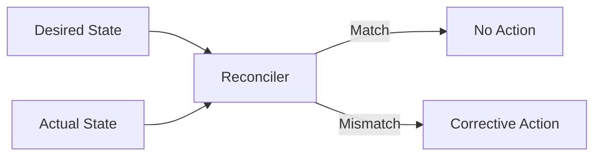
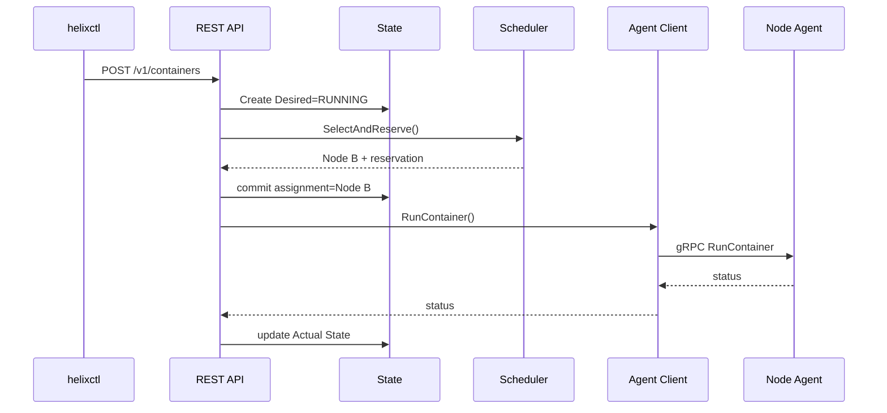
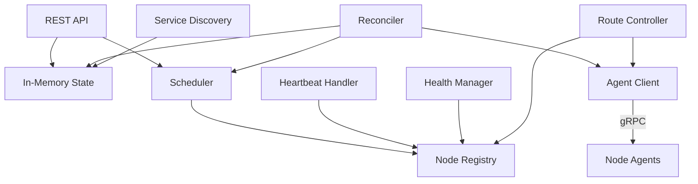

# Helixctl Control Plane

> Design for cluster state, node membership, scheduling, health monitoring, reconciliation, route coordination, and service coordination inside `helixd`.

---

## 1. Purpose

The Helix Control Plane is the cluster brain.

It owns **intent and decisions**.

It does not create namespaces, cgroups, veth pairs, or Linux processes directly.

The boundary is:

```text
Helix Control Plane
        |  commands / routes
        v
Helix Node Agent
        |  registration / heartbeat / status
        +-------------------------------> Control Plane
        |
        +--> Helix Runtime
        +--> Helix Network Manager
```

The Control Plane answers:

> What should be running, and where should it run?

---

# 2. Control Plane Components

```text
helixd
├── REST API Server
├── In-Memory Cluster State
├── Node Registry
├── Scheduler
├── Health Manager
├── Reconciler
├── Route Controller
├── Service Discovery
└── Agent Client
```

Each component has a narrow responsibility so cluster logic does not turn into one large shared state machine.

---

# 3. Package Structure

```text
internal/controlplane/
├── server/
├── scheduler/
├── registry/
├── reconciler/
├── health/
├── routes/
└── state/
```

Related components:

```text
internal/discovery/
internal/agentclient/
internal/domain/
```

---

# 4. `helixd` Startup

A clean startup order is:

```text
load configuration
    ↓
initialize logging
    ↓
create in-memory cluster state
    ↓
create Node Registry
    ↓
create Scheduler
    ↓
create Agent Client
    ↓
create Route Controller
    ↓
create Service Discovery
    ↓
create Health Manager
    ↓
create Reconciler
    ↓
start ControlPlaneService gRPC API
    ↓
start REST API
    ↓
start background loops
```

No SQL or external database is required in the first complete version.

---

# 5. In-Memory Cluster State

The Control Plane keeps the current cluster model in memory.

Conceptually:

```go
type State struct {
    mu sync.RWMutex

    nodes     map[string]Node
    workloads map[string]Workload
    services  map[string]Service
    endpoints map[string][]Endpoint
    routes    map[string]Route
}
```

The exact indexes can evolve.

The important rule is that state ownership is centralized.

Other packages should not each maintain independent authoritative copies of the same cluster objects.

---

# 6. Why In-Memory State

The first version focuses on:

- orchestration
- concurrency
- scheduling
- runtime integration
- networking
- health
- service discovery
- failure recovery while the Control Plane is alive

A database would introduce another subsystem before the core control loop is proven.

The limitation is explicit:

```text
helixd restart
    ↓
Control Plane desired-state memory is lost
```

Agents can reconnect and reconstruct much of the **actual** state, but historical user intent is not guaranteed to survive.

---

# 7. Concurrency Model

Several goroutines access state concurrently:

```text
REST handlers
heartbeat processing
health evaluation
scheduler
reconciler
route controller
service discovery updates
```

State access must therefore be synchronized.

A simple starting point is:

```text
sync.RWMutex
```

with:

```text
RLock for reads
Lock for writes
```

Later performance work can introduce more granular locking only if measurements justify it.

---

# 8. State API

Packages should call methods rather than directly accessing shared maps.

Example:

```go
type ClusterState interface {
    AddNode(Node) error
    UpdateNode(Node) error
    GetNode(string) (Node, bool)
    ListNodes() []Node

    AddWorkload(Workload) error
    UpdateWorkload(Workload) error
    GetWorkload(string) (Workload, bool)
    ListWorkloads() []Workload
}
```

This keeps locking and indexing inside one boundary.

---

# 9. Node Registry

The Node Registry tracks worker nodes.

A Node record can contain:

```text
Node ID
Hostname
Management IP
Agent RPC Address
Container CIDR
Total CPU
Available CPU
Total Memory
Available Memory
Agent Version
Health State
Network Readiness
Last Heartbeat
```

The Registry provides the Scheduler and Health Manager with a cluster view.

---

# 10. Node Registration

At Agent startup:

```text
Helix Node Agent
    |
    | RegisterNode()
    v
Helix Control Plane
```

Registration should validate:

- unique node identity
- valid management address
- valid Agent RPC address on the trusted management network
- valid container CIDR
- no conflicting node CIDR
- supported Agent version where required

The Agent Client stores/uses the registered Agent RPC address to dial the Agent-hosted `AgentService`. The Control Plane then marks the node as registered but should only schedule onto it after readiness requirements are satisfied.

---

# 11. Heartbeats

Agents send periodic heartbeats.

A heartbeat may include:

```text
Node ID
Timestamp
Available CPU
Available Memory
Running containers
Network readiness
Agent health
```

The Control Plane records the latest observation.

---

# 12. Health States

A useful node-health model:

```text
REGISTERING
HEALTHY
SUSPECT
UNREACHABLE
NOT_READY
```

Example transition:

```text
HEALTHY
  ↓ missed heartbeats
SUSPECT
  ↓ timeout exceeded
UNREACHABLE
```

Network readiness can be tracked separately because a node can be alive while container networking is broken.

---

# 13. Failure Detection Is Not Proof of Death

A missed heartbeat means:

> The Control Plane cannot currently communicate with this node.

It does not prove:

> The machine has definitely stopped.

Possible causes:

- host crash
- Agent crash
- network partition
- CPU starvation
- packet loss
- Control Plane connectivity issue

This ambiguity matters during rescheduling.

---

# 14. Scheduler

The Scheduler chooses a node for a workload. It operates on domain data and must not modify Linux state, call cgroups/netlink, or create processes.

## 14.1 Resource Reservations

Heartbeat-reported capacity alone is insufficient for concurrent scheduling. v1 uses Control Plane reservations so two placement requests cannot consume the same apparent free resources.

```text
Effective Schedulable Capacity
=
Node Capacity - Reserved Resources
```

Placement is conceptually atomic with respect to competing schedulers:

```text
validate request
    ↓
filter eligible nodes
    ↓
score candidates
    ↓
select node
    ↓
reserve requested CPU / memory
    ↓
commit assignment
    ↓
dispatch RunContainer
```

Reservations are released or adjusted when placement permanently fails, a workload is deleted/cancelled, an execution is intentionally stopped with no replacement desired, or reconciliation supersedes the assignment. Temporary Agent communication errors do not automatically discard ownership; reconciliation handles the uncertain state.

---

# 15. Scheduling Pipeline

```text
Candidate Nodes
    ↓
Filter
    ↓
Eligible Nodes
    ↓
Score
    ↓
Selected Node
    ↓
Reserve CPU / Memory
    ↓
Commit Assignment
```

---

# 16. Filtering

Initial filters:

```text
node is HEALTHY
network is READY
enough CPU
enough memory
```

Later filters can include:

```text
available IP capacity
labels
taints
affinity
architecture
```

These are not required initially.

---

# 17. Least-Load Scoring

The primary scheduler strategy is:

```text
resource filtering
+
least-load scoring
```

Round-robin remains useful as a baseline implementation.

An interface keeps the policy replaceable:

```go
type Scheduler interface {
    SelectNode(
        workload Workload,
        nodes []Node,
    ) (Node, error)
}
```

---

# 18. Why Scheduler Policy Is an Interface

The Control Plane should not need to change when a placement algorithm changes.

Possible implementations:

```text
RoundRobinScheduler
LeastLoadScheduler
```

Future work can add other strategies without changing API handlers or the Node Agent.

---

# 18A. Placement Reservations

Scheduler decisions must account for concurrent create requests between heartbeats. The Control Plane should therefore reserve requested CPU and memory atomically when a placement is committed.

```text
observed node capacity
    ↓
subtract active reservations
    ↓
effective schedulable capacity
    ↓
filter + score + reserve
```

Reservations are released or reconciled when placement fails, a workload stops, or the assignment is replaced. Heartbeat values remain observations; they are not the synchronization mechanism for concurrent placement.

---

# 19. Desired State

Desired state represents user intent.

Example:

```text
Workload C1:
Desired = RUNNING
```

Desired state is created by API operations and kept in the Control Plane's in-memory state.

---

# 20. Actual State

Actual state represents observations from worker nodes.

Example:

```text
Workload C1:
Node   = node-b
Actual = RUNNING
PID    = 4821
IP     = 10.10.2.7
```

Actual state comes from Agent reports and lifecycle responses.

---

# 21. Reconciliation

The Reconciler compares:

```text
Desired State
vs
Actual State
```

If they differ, it calculates corrective action.



---

# 22. Reconciliation Examples

### Missing workload

```text
Desired = RUNNING
Actual  = ABSENT
```

Action:

```text
schedule + create
```

### Failed workload

```text
Desired = RUNNING
Actual  = FAILED
```

Action:

```text
restart or reschedule
```

### Stop requested

```text
Desired = STOPPED
Actual  = RUNNING
```

Action:

```text
stop through Node Agent
```

---

# 23. Reconciler Dependencies

A useful dependency boundary:

```go
type Reconciler struct {
    state     ClusterState
    scheduler Scheduler
    agents    AgentClient
    services  ServiceRegistry
}
```

The Reconciler should not know:

- SQLite
- Protobuf internals
- Linux syscalls
- veth implementation

---

# 24. Agent Client

`internal/agentclient/` is the Control Plane's transport adapter for Node Agents.

Flow:

```text
Control Plane domain request
    ↓
AgentClient
    ↓
convert to Protobuf
    ↓
gRPC
    ↓
Node Agent
```

The rest of the Control Plane should work with domain types instead of generated Protobuf types.

---

# 25. Route Controller

The Route Controller manages desired cluster routes.

It consumes:

```text
Node management IP
Node container CIDR
Node health/readiness
```

It calculates routes such as:

```text
10.10.2.0/24 via 192.168.50.12
```

Then it sends route updates through the Agent Client.

Detailed networking behavior lives in [`NETWORKING.md`](NETWORKING.md).

---

# 26. Route Reconciliation

Route programming should be treated as desired state.

```text
Desired routes
vs
Agent/kernel-reported managed routes
```

Missing routes are added.

Obsolete Helix-owned routes are removed.

This avoids assuming that a one-time route mutation remains correct forever.

---

# 27. Service Discovery Coordination

The Control Plane hosts/coordinated the first Service Discovery implementation.

Components:

```text
Service Registry
Endpoint Store
Health Filter
Internal DNS
```

The Reconciler and Agent reports update endpoint state when workloads:

- start
- fail
- stop
- move to another node

---

# 28. Endpoint Readiness

A container should not immediately become a healthy service endpoint just because a process exists.

The minimum v1 workload-health condition is **process health**: the container process is still running. This keeps the first version deterministic while allowing later HTTP, TCP, or exec probes.

A useful path:

```text
container instance RUNNING
    ↓
process health satisfied
    ↓
endpoint HEALTHY
    ↓
eligible for DNS response
```

Later health-check types can refine endpoint readiness without changing the Service/Endpoint model.

---

# 29. Workload Creation Flow



Whether creation is fully synchronous or accepted-and-reconciled can evolve, but desired state should be recorded before the cluster forgets why the workload exists.

---

# 30. Node Failure Flow

```text
heartbeats stop
    ↓
Health Manager marks node SUSPECT
    ↓
health timeout
    ↓
node UNREACHABLE
    ↓
workloads on node become UNKNOWN
    ↓
service endpoints become unavailable
    ↓
Reconciler sees Desired RUNNING
    ↓
Scheduler picks another node
    ↓
replacement workload created
```

---

# 31. Network Partition Risk

If Node B is actually alive but unreachable from the Control Plane, rescheduling can create a duplicate logical workload.

The first version documents this limitation.

Future protections can include:

```text
leases
fencing
generation numbers
ownership tokens
consensus-backed state
```

---

# 32. Control Plane Restart

Because state is in memory:

```text
helixd restart
    ↓
desired-state memory lost
```

Existing worker processes may continue.

After restart:

```text
Agents reconnect
    ↓
Nodes register again
    ↓
Agents report running containers
    ↓
actual cluster state is rebuilt
```

The reconstructed actual state is not the same as recovering historical desired intent.

This is an intentional first-version trade-off.

---

# 33. Background Loops

Long-running Control Plane loops can include:

```text
Health Evaluation Loop
Reconciliation Loop
Route Reconciliation Loop
Endpoint Cleanup Loop
```

All should share a parent `context.Context` so shutdown can stop them cleanly.

---

# 34. Graceful Shutdown

`helixd` shutdown should:

```text
stop accepting new REST requests
    ↓
stop background control loops
    ↓
allow in-flight operations to finish within timeout
    ↓
close listeners
    ↓
exit
```

Stopping the Control Plane should not automatically kill worker containers.

---

# 35. REST API Boundary

The external REST layer should:

- parse request DTOs
- validate syntax
- convert DTOs to domain commands
- call application services
- convert domain results to responses

It should not contain scheduling algorithms.

---

# 36. Domain Model Boundary

The Control Plane should use:

```text
domain.Node
domain.Container
domain.Service
domain.Endpoint
```

rather than spreading:

```text
HTTP request structs
Protobuf messages
kernel structs
```

through orchestration logic.

---

# 37. Logging

Useful fields:

```text
component
request_id
node_id
container_id
service
operation
state
duration
error
```

Example:

```text
component=scheduler
container_id=ctr-123
selected_node=node-b
strategy=least-load
```

---

# 38. Metrics

Useful metrics:

```text
nodes_healthy
nodes_suspect
nodes_unreachable

scheduler_requests_total
scheduler_failures_total
scheduler_latency_seconds

reconcile_total
reconcile_failures_total

heartbeats_received_total
heartbeats_missed_total

reschedules_total
route_reconcile_failures_total
```

---

# 39. Scheduler Unit Tests

Test:

- unhealthy node filtering
- insufficient CPU filtering
- insufficient memory filtering
- least-load ordering
- deterministic behavior where required
- no-eligible-node behavior

---

# 40. Reconciler Tests

Test desired/actual combinations:

```text
RUNNING / RUNNING
RUNNING / ABSENT
RUNNING / FAILED
RUNNING / UNKNOWN
STOPPED / RUNNING
STOPPED / STOPPED
```

The test should assert the selected corrective action, not only the final status string.

---

# 41. Health Tests

Test:

- heartbeat refresh
- transition to SUSPECT
- transition to UNREACHABLE
- recovery after heartbeat resumes
- network readiness separate from liveness

Avoid wall-clock-heavy tests where possible by injecting a clock.

---

# 42. Control Plane Integration Tests

Examples:

```text
REST create workload -> scheduler -> fake AgentClient
heartbeat -> node state update
node failure -> reconciler -> replacement scheduling
route topology update -> ApplyRoutes call
container health update -> service endpoint update
```

---

# 43. Control Plane Definition of Done

- [ ] Nodes can register.
- [ ] Node capacity is tracked.
- [ ] Heartbeats update liveness.
- [ ] Node health transitions work.
- [ ] In-memory state is concurrency-safe.
- [ ] Scheduler filters unhealthy/insufficient nodes.
- [ ] Least-load scoring selects a node.
- [ ] Desired and actual state are separate.
- [ ] Reconciler detects mismatches.
- [ ] Reconciler can trigger workload creation.
- [ ] Reconciler can trigger workload stop.
- [ ] Unreachable-node workloads can be rescheduled.
- [ ] Route Controller distributes desired routes.
- [ ] Service endpoints follow workload health.
- [ ] Control Plane does not import Runtime internals.
- [ ] `go test -race` passes for Control Plane packages.

---

# 44. Control Plane Diagram



---

# 45. Final Control Plane Model

The Control Plane should stay focused on cluster intent:

```text
observe cluster
    ↓
decide desired correction
    ↓
ask a Node Agent to execute
    ↓
observe new actual state
```

It should never become the place where Linux runtime or networking syscalls are executed directly.
